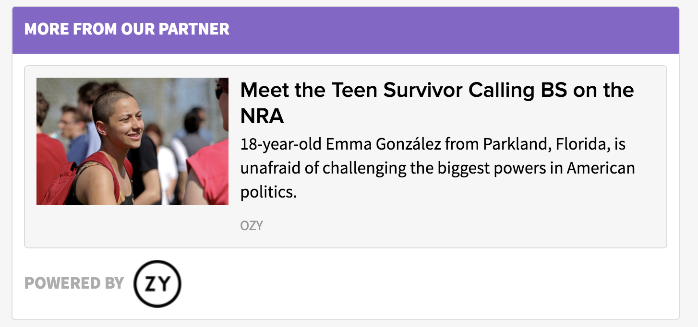
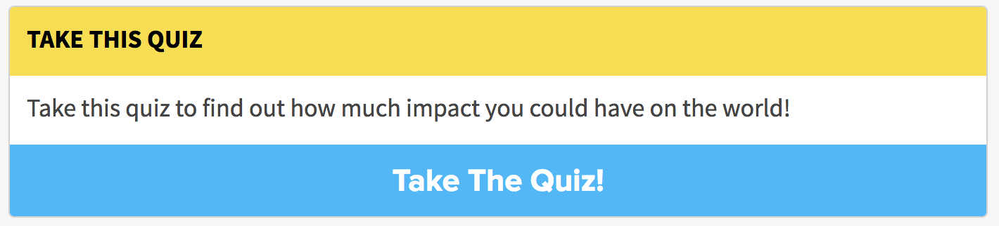
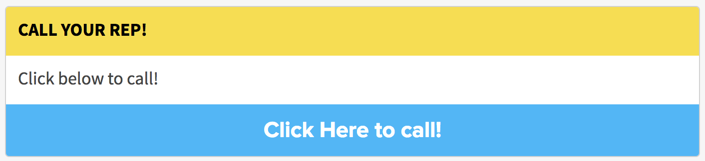

# Link Action

The `LinkAction` component renders a visual component which features an embedded link. It allows us to present a link that we'd like DoSomething.org members to follow in a clear and actionable format.

  

It can also be equipped with an affiliate logo, which it will feature within the link action, and will change the background color of the card title to purple:

If you fill in the Button Text field, instead of rendering an embedded link, the Link Action will have a button to the link with the provided text:

## Link Action = Call Action!

The `LinkAction` can also feature a link to a valid US telephone number! (To allow for a 'call your member of congress' type actions and the like).

This can be done by adding the phone number instead of a URL to the `link` field and -importantly- prefixing the telephone number with `tel:`. E.G. `tel:212 254-2390`.

Be sure to add some Button Text via the `buttonText` field if you're linking to a telephone number to override the link embed, as this won't embed nicely (since it's a phone number and not a valid URL!).

## Usage Instructions
The Link Action consists of three fields:

- **title (required)**: The title that will show up in the yellow bar atop the Link Action.
- **content (optional)**: content in Markdown format that will appear within the card atop the link.
- **link (required)**: a valid URL which will be embedded within the card, or a telephone link which will be linked to through the button.
- **buttonText (optional)**: Text for button to link which will replace the embedded link. (*this is required for a telephone link action!*)
- **affiliateLogo (optional)**: an image URL which will be featured on bottom of the action. (adding this property will also cause a color change in the title of the action)
