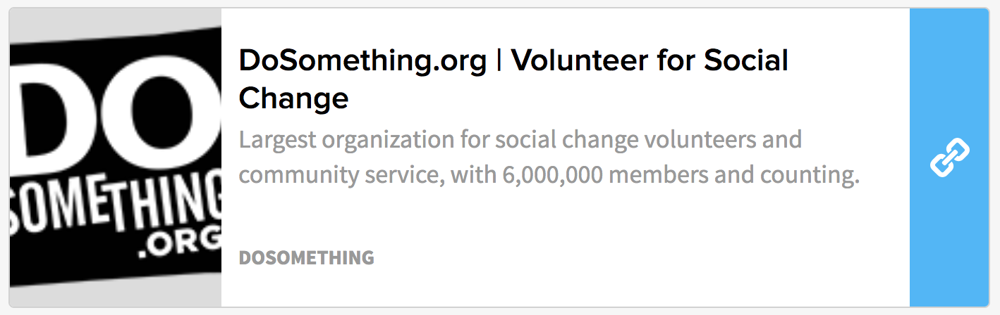
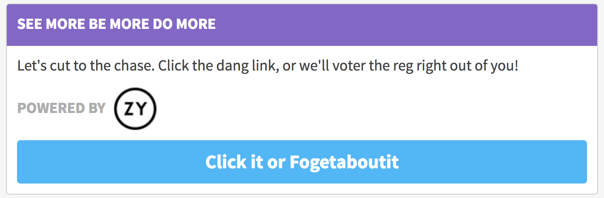
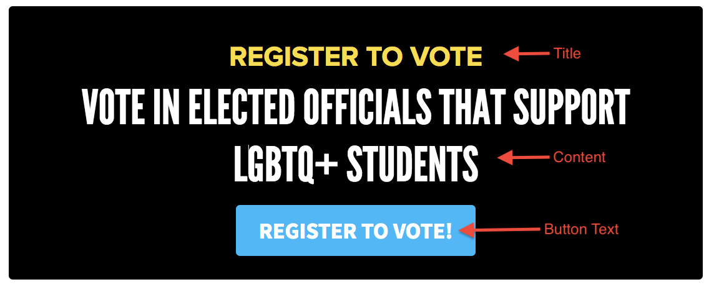

# Link Action

The `LinkAction` renders a visual component which features an embedded link render-able in various ways. It allows us to present a link that we'd like DoSomething.org members to follow in a clear and actionable format.

## Embed

If the Content field is left blank, the Link Action will render as an plain embedded link:

## Link Action Card

If you fill in the Content field, instead of rendering an embedded link, the Link Action will be featured within a Card, and render a button \(the button text can be edited via the Button Text field\):

## Affiliate Logo

If you add an affiliate logo via the Affiliate Logo field, the Link Action will feature the logo, and will change the background color of the card title to purple:

## Link Action = Call Action!

The `LinkAction` can also feature a link to a valid US telephone number! \(To allow for 'call your member of congress' type actions and the like\).

This can be done by adding the phone number instead of a URL to the `link` field and -importantly- prefixing the telephone number with `tel:`. E.G. `tel:212 254-2390`.

Be sure to add some Content via the `content` field if you're linking to a telephone number to ensure the link is rendered in a Card, as this won't embed nicely \(since it's a phone number and not a valid URL!\).

## CTA Link Action

You can have the Link Action render as a Call To Action-like component by selecting the `cta` value in the Template field.

## Usage Instructions

The Link Action consists of the following fields:

* **title \(required\)**: the title that will show up in the yellow bar atop the Link Action Card \(If Content is provided\), or the CTA title.
* **content \(optional\)**: content in Markdown format that will appear within the card atop the link. _Filling this out will cause the Link Action to render as a Card_.
* **link \(required\)**: a valid URL which will be embedded within the card, or a telephone link which will be linked to through the button.
* **buttonText \(optional\)**: text for button to link when Link Action is in Card or CTA mode. \(_this is required for a telephone link action!_\)
* **affiliateLogo \(optional\)**: an image URL which will be featured on bottom of the action. \(adding this property will also cause a color change in the title of the link action if it's in Card mode\)
* **template \(optional\)**: toggle between Default and CTA modes.

