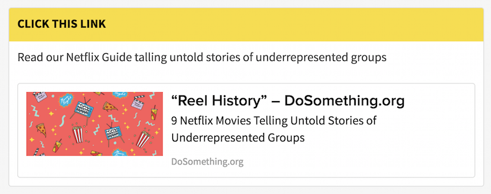

# Link Action
***

The `LinkAction` component renders a visual component which features an embedded link. It allows us to present a link that we'd like DoSomething.org members to follow in a clear and actionable format.

  

## Usage Instructions
The Link Action consists of three fields:

- **title (required)**: The title that will show up in the yellow bar atop the Link Action.
- **content (optional)**: content in Markdown format that will appear within the card atop the link.
- **link (required)**: a valid URL which will be embedded within the card.

