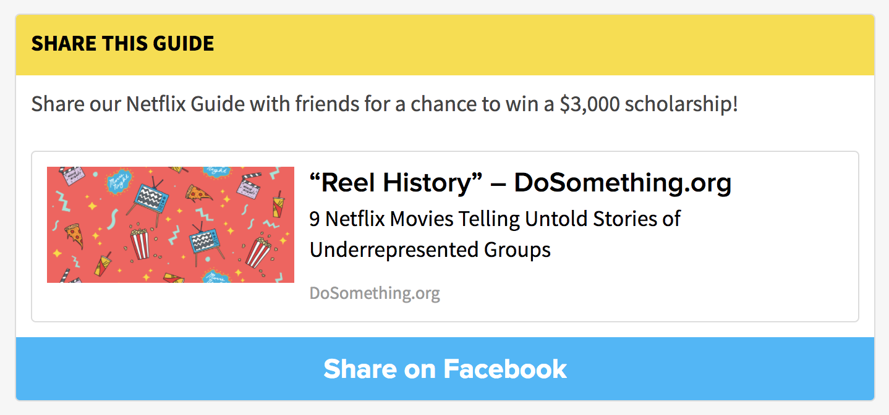

# Share Action

The `ShareAction` component renders a visual component which features an embedded link, and a social share button (specifically a Facebook or Twitter share button). Clicking the social share button will trigger the Facebook Share modal or Twitter intent window to open, populated with the embedded link. For Facebook shares, the component includes functionality to track a successful or canceled share, for an automatic Reportback process (enabling the DoSomething member to skip manually reporting back with a snapshot of their Facebook share).

  

## Usage Instructions
The Share Action consists of three fields:

- **title (required)**: The title that will show up in the yellow bar atop the Link Action.
- **socialPlatform (required)**: The social platform that the Share Action will share to. (Limited to Facebook or Twitter).
- **content (optional)**: content in Markdown format that will appear within the card atop the link.
- **link (required)**: a valid URL which will be embedded within the card, and used as the URL for the social share button.

