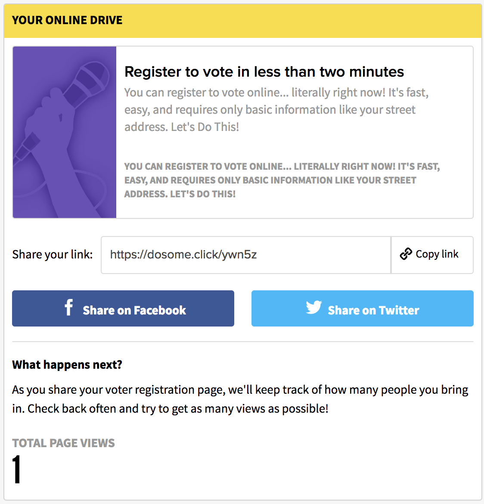

# Social Drive Action

The `SocialDriveAction` component renders a dashboard interface to share and track a personalized shortened link. It features the embedded personalized link, a clipboard copier for said link, buttons to share on Facebook and Twitter \(with Puck™ event tracking\), some information, as well as the total amount of page views for the link.

Behind the scenes, this component will shorten and track the provided link using our in house [Bertly™](https://github.com/DoSomething/bertly) system.

## Usage Instructions

The Social Drive Action consists of two fields:

* **internalTitle** _\(required\)_: the title used internally to find this component in Contentful; please follow helper text displayed under the field for suggested naming convention.
* **link \(required\)**: a valid URL which will be processed and displayed by the component.

### Link Tokens

The **link** field can be equipped with a `{userId}` token, which will be replaced by the authenticated users Northstar ID. e.g. `https://identity.dosomething.org/users/{userId}` will be replaced with `https://identity.dosomething.org/users/1234` \(for an authenticated user with a Northstar ID of `1234`\).

### What Happened to What Happens Next?

As of now this component is specifically coded for Voter Registration Social Drives, which consequentially means - as you may have noted that - that the info displayed atop the Total Page Views section is not editable. This will be updated soon!
