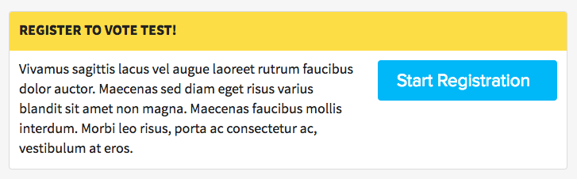

# Voter Registration Action
***

The `VoterRegistrationAction` component renders a visual component which allows DoSomething.org members to register to vote via a link to an external voter registration partner.




## Usage Instructions
When creating a new _Voter Registration Action_ on Contentful, you are required to enter a value for the `link` field.

Enter a full URL where the member should be directed to upon clicking on the button in the start their registration.

You can use select _tokens_ in the specified URL to include dynamic information. These tokens will be replaced with actual values.

The following tokens are available for use in the `link` field:
- `{campaignId}`: will be replaced with the campaign ID.
- `{campaignRunId}`: will be replaced with the campaign run ID.
- `{northstarId}`: will be replaced with the user's Northstar ID.
- `{source}`: will be replaced with a value of `web`.


### Examples:
If you enter the following URL string into the `link` field:
```http
http://example.com?userId={northstarId}&campaign={campaignId}&source={source}
```

The resulting URL for the rendered button on the page will be:
```http
http://example.com?userId=551a2b3c4d5e6f7g8h9i0j1k2&campaign=1234&source=web
```

As another example, if you enter the following URL string into the `link` field:
```http
https://turbonotes.xyz/?r=user:{northstarId},campaign:{campaignId},source:{source}
```

The resulting URL for the rendered button on the page will be:
```http
https://turbonotes.xyz/?r=user:551a2b3c4d5e6f7g8h9i0j1k2,campaign:1234,source:web
```
