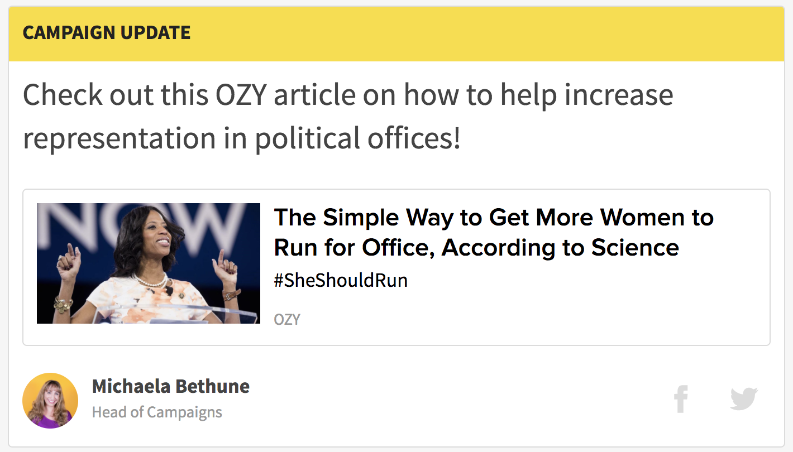
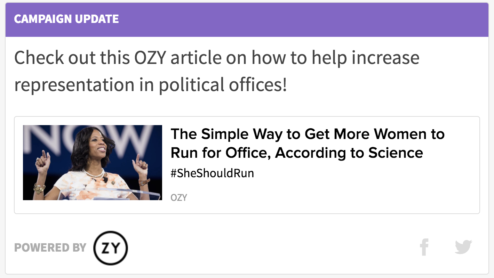

# Affiliate Update

## Campaign Update \(default\)

The `CampaignUpdate` component renders a visual component which can feature campaign updates, announcements and informational content rendered in Markdown format, as well as an embedded link \(this can be to an article, a video, any valid URL will do!\). ~In the right hand side of the footer of the Campaign Update we add a Facebook and Twitter social share icon. \(The metadata for the content of the share can be customized, but will default to be a share of the link to the Campaign Update\).~ \(social share -temporarily disabled\), A Byline featuring the author of the Campaign Update \(another customizable setting\), will be set on the left hand side of the Campaign Update footer.

## Affiliate Update

The Campaign Update can also be equipped with an affiliate logo. If this field is set, the campaign update will render in 'Affiliate' mode, highlighting the Campaign Update with purple coloring in the title, as well as replacing the author Byline with a promotion for the affiliate, featuring the provided logo.

## Usage Instructions

The Campaign Update consists of five fields:

* ~**displayOptions \(required\)**: the amount of width across the page that the campaign update should occupy \('two-thirds', or 'full'\)~ - All campaign updates are now displayed at full width across the page.
* **content \(optional\)**: content in Markdown format that will appear within the campaign update \(on top of the link, if provided\).
* **link \(required\)**: a valid URL which will be embedded within the card.
* **author** \(optional\)\*\*: a reference to the Contentful Entry of the author to be displayed on the campaign update. \(This will be overriden by the affiliateLogo field, if provided\)
* **affiliateLogo \(optional\)**: an image URL which will be featured in place of the author byline. \(adding this property will also cause a color change in the title of the campaign update\)

