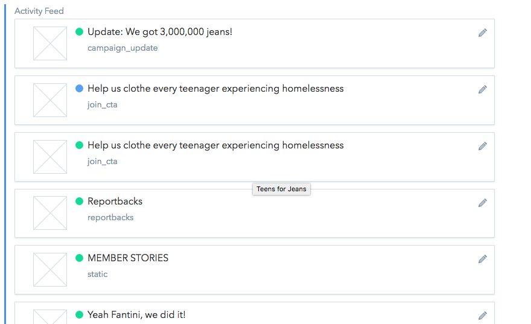

# Feed Order

1) The feed is ordered _earlies_ on the bottom to _latest_ at the top.

2) To change this order, just hover over one of the blocks in the **Activity Feed** section and just drag and drop things in whatever order you want!

3) An important note is that the feed is actually ordered most recent at the bottom to oldest at the top to accommodate how contentful adds in new updates.

4) *One thing to keep in mind though - you should look at the published feed to make sure all of the slots are filling in correctly. One row in the feed is 3 columns, or `two-thirds` of a display option.*

5) If the pieces of the feed do not fill the entire space, reportbacks will fill in the space in between.

