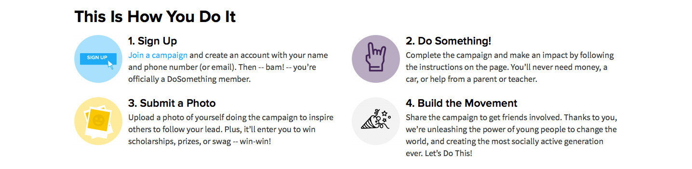

# Gallery Block

The `GalleryBlock` component renders its attached items in a grid of media + text.
The Gallery Block can be customized in various ways to control the alignment and formatting.

_Gallery of DoSomething Staff Members: (top aligned, three items per row.)_

## Usage Instructions

The Share Action consists of the following fields:

- **internalTitle** _\(required\)_: the title used internally to find this component in Contentful; please follow helper text displayed under the field for suggested naming convention.
- **title \(optional\)**: The title will appear atop the gallery.
- **blocks \(required\)**: The blocks which will be rendered by the gallery. A minimum of 2 entries must be attached.
- **imageAlignment \(required\)**: Specify where the image should be aligned relative to the text.
- **itemsPerRow \(required\)**: The maximum number of items in a single row of the gallery.
- **imageFit** \(optional\): Determines the cropping method used for the Gallery Block item's images. Defaults to "Fill", which will resize the images to ensure they fit neatly into a square, cropping the image if needed - and which is probably be perfectly fine for most galleries. "Pad" will do the same but will add padding to the image instead of cropping it, which is useful for images with a particular shape (e.g. a wide rectangle) which would be improperly cropped with "Fill".

_Gallery of DoSomething Tech Advisory Board (left aligned, two items per row.)_

## Gallery Block Types

We'll go over the various types of entries which can be attached in the **blocks** field, and how they will be treated.

**Person**

- `staff`: the gallery will use the `alternatePhoto` as the image, `name` as the caption (linking to their `twitterId` id set, and the `jobTitle` as the description).
- `board member`: `alternatePhoto` for the image, `name` for the caption, `description` for description.
- `advisory board member`: `photo` for the image, `name` for the caption, `description` for description

**Page**

The gallery will use the `coverPhoto` field for the image, `title` for the caption (which will link to the page using the `slug` field), `subTitle` for the description.

**Campaign**

The gallery will use the `coverPhoto` field for the image, `title` for the caption (which will link to the campaign using the `slug` field), `callToAction`/`tagline` for the description.

**Content Block**

Content Blocks can be used for more static galleries which aren't displaying already existent content.
The gallery will use the `image` field for the image, `title` field as the caption, and `content` field as the description.

_Gallery of Content Type blocks: (left aligned, two items per row.)_

