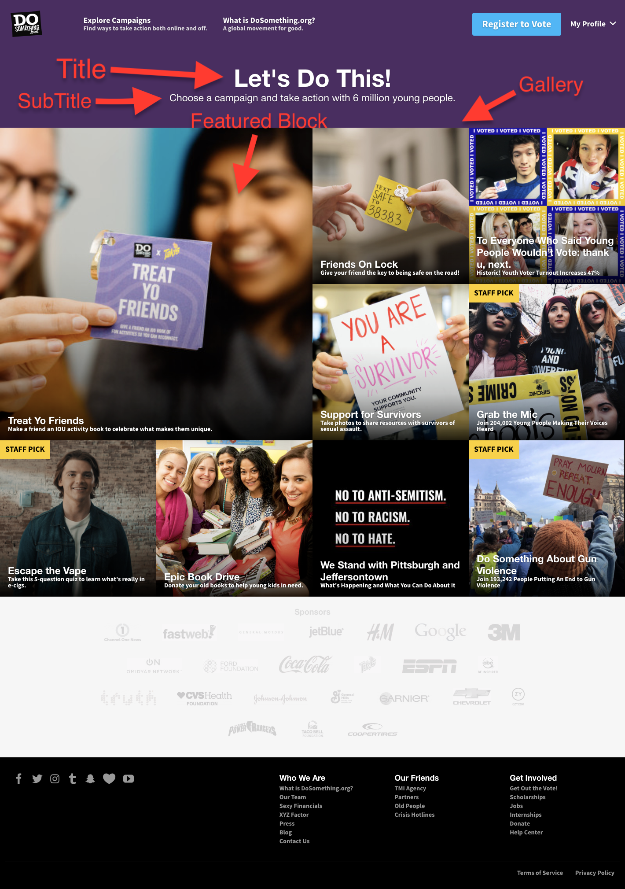

# Home Page

The DoSomething.org home page - the page users see when they hit the canonical website URL - is controlled by a HomePage entry on Contentful (we default to using the most recently updated HomePage entry.)

The HomePage consists of the following fields:

- **Internal Title** _\(required\)_: This is for our internal Contentful organization and will be how the block shows up in search results, etc. It should include the Year-Month and the title of the page to help find this content in the system.
- **Title** _\(required\)_: This will be displayed as the title on the page.
- **SubTitle** _\(required\)_: This will be displayed beneath the title in smaller text.
- **Blocks** _\(required\)_: The list of referenced blocks which will appear in the gallery on the page. These can be Campaigns or Pages.

## Home Page Gallery

The core of the home page is the gallery consisting of Campaigns or articles we want featured on our site. You can add the desired entries via the **Blocks** field. Historically, we've limited the amount of gallery blocks to 9. The first block will be featured within the gallery and will consume two rows and columns in the top left corner of the gallery.

The gallery blocks consist of an image, with a title and tagline. These fields will be pulled from the respective entries as follows:

#### Campaign

- **Cover Image**
- **Title**
- **Call To Action**

#### Page

- **Cover Image**
- **Title**
- **SubTite**


The **Cover Image** and **SubTitle** fields are optional for Pages, so make sure that if you're adding a page to the gallery it has these fields set.


## Sponsor list

The Home Page also features a list of sponsors at the bottom. If you need to add a sponsor to the list or update an existing one, please consult with the Rocket Team.

