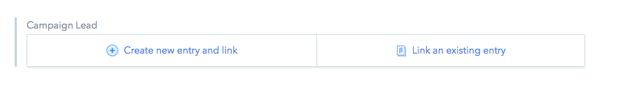
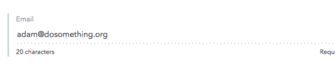
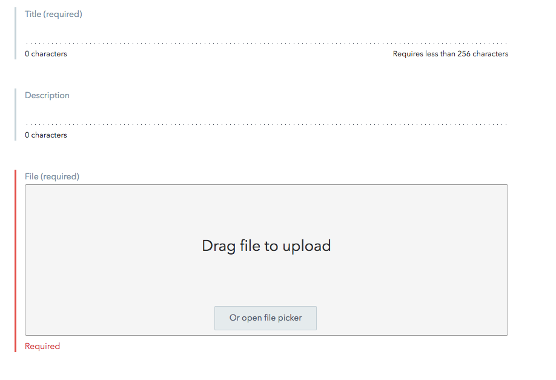

# Campaign Lead

On the campaign, you can add a campaign lead for the entire campaign.

This is where the email will pull for the campaign lead in the footer.

Unless you are new, you should already be in the system, so _please check "link existing entries" first!!_.

If the campaign lead does not exist, Create a new entry.

* **Internal Title**: Full name of Campaign Lead
* **Name**: Full name
* **Title**: Campaign Lead
* **Photo**: upload a new photo if photo does not exist in contentful yet

