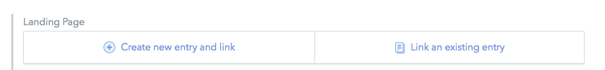
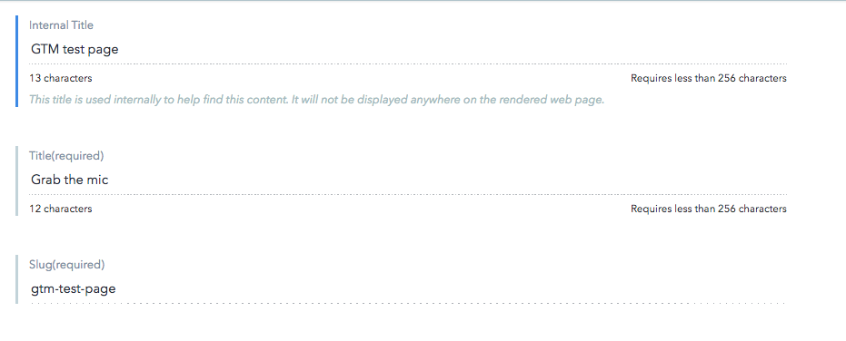
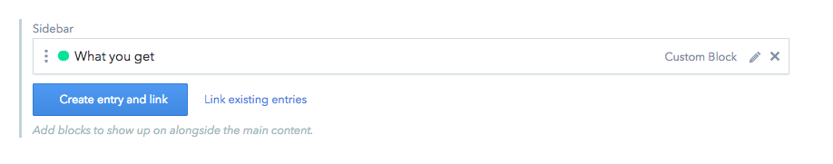
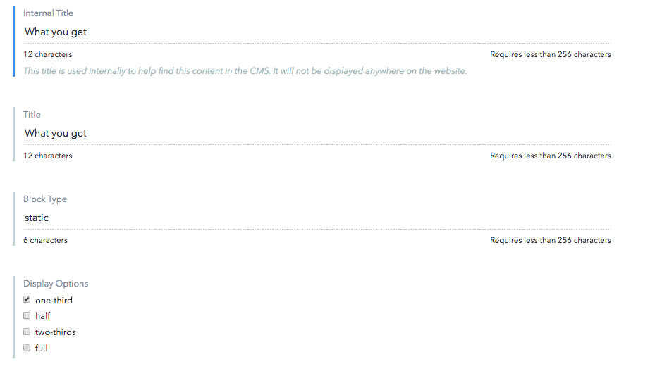
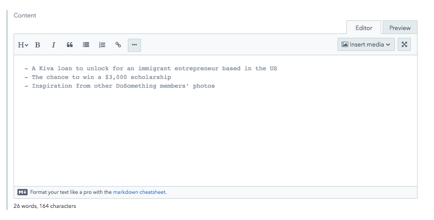

# Landing Page

You can attach a **Landing Page** to a campaign to provide some initial context to members regarding a campaign.

Find the section called **Landing Page** at the bottom of the Campaign page.

For the "Landing Pitch Page" content:

* **Internal Title** should be: Campaign name year-month pitch page.
* **Title** should match the lede banner title.
* **Slug** should match the slug of the campaign.

For the "Problem/Solution/What You Get" content items:

* "The Problem" and "The Solution" go into the **Content** markdown field.

What you get is attached as a entry to the **Sidebar** field. Click "Create new entry and link" beneath the **Sidebar** field.

Give an **Internal Title**, a published **Title**, and make it a `static` **Block Type** with `one-third` for the **Display Options**.

Add in the new content into the **Content** field, with whatever markdown needed.

Click "Publish”

Hit Back

Hit "Publish" on the Campaign page; you should now have a pitch page.

