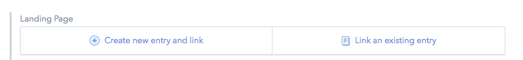
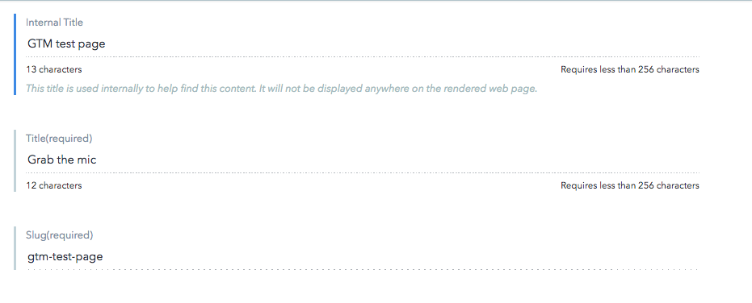
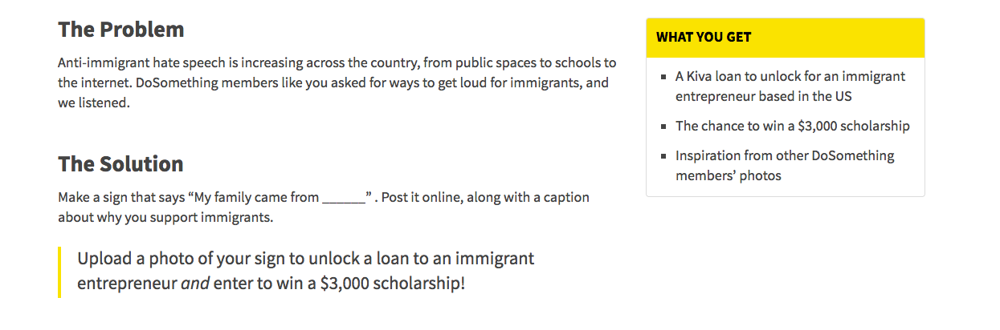

# Landing Page

1. Find the section called **Landing Page** at the bottom of the Campaign page. 
2. For the "Landing Pitch Page" content:
3. **Internal Title** should be: Campaign name year-month pitch page.
4. **Title** should match the lede banner title.
5. **Slug** should match the slug of the campaign 
6. For the "Problem/Solution/What You Get" content items:
7. "The Problem" and "The Solution" go into the **Content** markdown field. 
8. What you get is attached as a entry to the **Sidebar** field. 1. Click "Create new entry and link" beneath the **Sidebar** field.  2. Give an **Internal Title**, a published **Title**, and make it a `static` **Block Type** with `one-third` for the **Display Options**.  3. Add in the new content into the **Content** field, with whatever markdown needed. 
9. Click "Publish”
10. Hit Back
11. Hit "Publish" on the Campaign page; you should now have a pitch page. 

