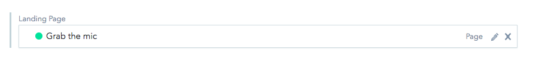
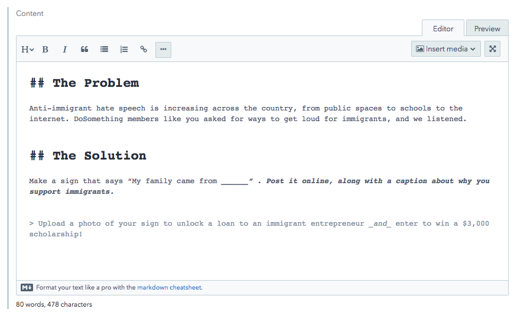
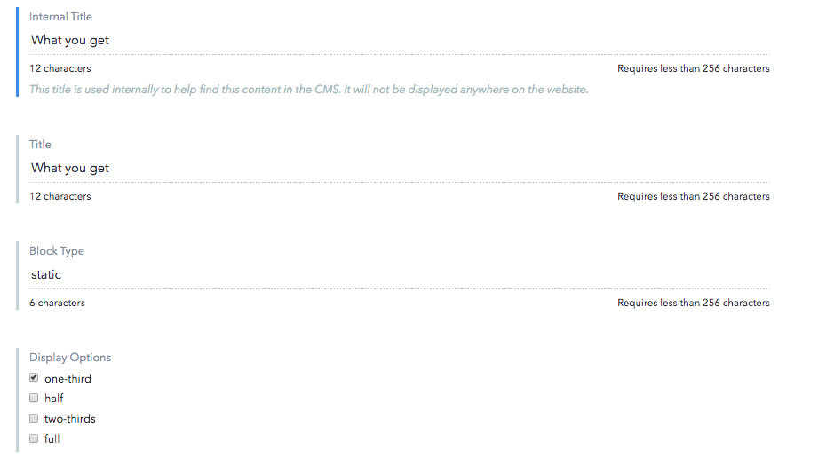
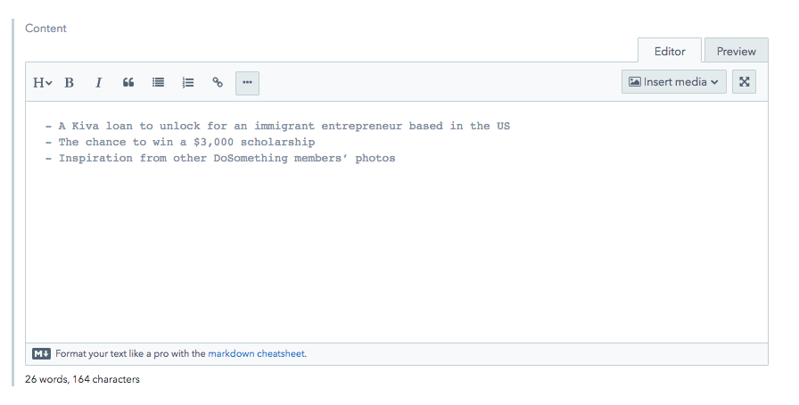

# Landing Page

1.  Find the section called **Landing Page** at the bottom of the Campaign page.
    

2.  For the "Landing Pitch Page" content:

* **Internal Title** should be: Campaign name year-month pitch page.
* **Title** should match the lede banner title.
* **Slug** should match the slug of the campaign
  

3.  For the "Problem/Solution/What You Get" content items:

* "The Problem" and "The Solution" go into the **Content** markdown field.
  
* What you get is attached as a entry to the **Sidebar** field.
  1.  Click "Create new entry and link" beneath the **Sidebar** field.
      
  2.  Give an **Internal Title**, a published **Title**, and make it a `static` **Block Type** with `one-third` for the **Display Options**.
      
  3.  Add in the new content into the **Content** field, with whatever markdown needed.
      

3.  Click "Publish”

4.  Hit Back

5.  Hit "Publish" on the Campaign page; you should now have a pitch page.
    
