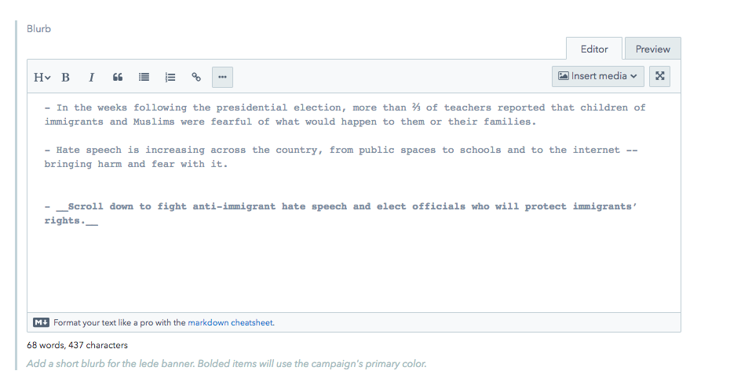
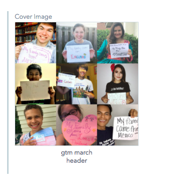

# Lede Banner

1.  **Title**: should already be filled in from the Campaign title.

2.  **Call To Action**: This is the large, emotional text below the title and what shows up at the bottom of pages to prompt the user to join.

3.  **Blurb**: This is the intro text. This is not required, and is suggested to use only if absolutely needed. We have seen that people scan the bottom part of the page better than this introduction text.
    

4.  Any **bold text** will show up in the yellow color. In the example above, the bold text is: _Scroll down…_

5.  Adding a **Cover Image**:

1)  Click "Create new asset and link".
2)  Fill in the fields.
3)  Click "Publish".
4)  Hit Back.
5)  Cover Image should be uploaded in that area for the field.
    

_Publish_ changes for the Campaign, the lede banner will show up on your campaign page!
