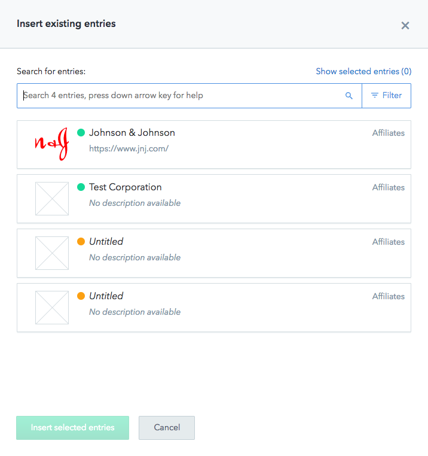

# Sponsor Logo

1. In the Campaign, find the section for **Affiliate Sponsor**.
2. Check to see if the sponsor you are looking for already exists before creating a new one, by clicking on "Link existing entries". A pop-up will show a list of current sponsor entries and you can search for a specific sponsor. 
3. If they do not exist, you can create a new entry and link it, using the "Create Affiliates and link" button.
4. **Internal Title**: this is the title/name of the affiliate sponsor and can be the same as the _Title_ field below.
5. **Title**: this is the title/name of the affiliate sponsor and will show up in the link in the footer of the page.
6. **Link**: this is the actual link for the affiliate sponsor, where the footer will link to externally.
7. **Logo**: this is the logo for the affiliate sponsor that is in the lede banner and in other components on the site.
8. After you are finished, _Publish_ the affiliate sponsor and then go back to the main page. 

