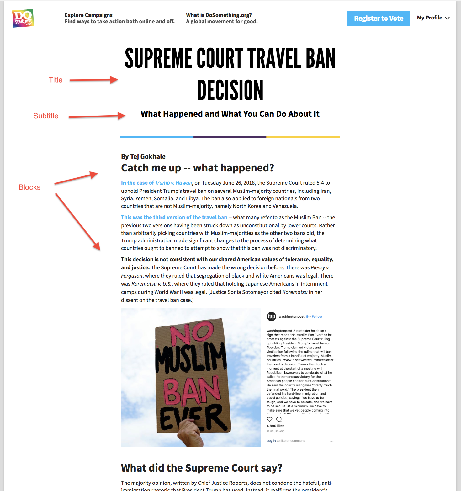

# Pages

The 'Page' Content Type is multi-purpose, and has gone through a few phases. We'll list the relavant ways to use a Page:

## 1. Campaign Sub Page

You can create what we refer to as "campaign sub pages", like the "FAQ" or "Scholarship" pages.
Please note that though this was the original use case for Pages, this will soon be deprecated in favor of the general Campaign Page approach mentioned below.

[Click Here for instructions on creating a Campaign Sub Page](campaign-sub-page-creation.md)

## 2. General Page

The philosophy behind Pages is that they exist as an amalgamation of blocks pieced together to create some a cohesive whole. This can be utilized to create a "sub page" for a campaign (Campaign Page), or to create a general independent piece of content (Content Page). We shall address both cases:

### Campaign Page

**As of now this only applies to 'Action' and 'Community' pages. (Which historically were created through Campaign Action Steps and Campaign Activity Feed fields)**

To create an Action page for a Campaign:

1.  in the Campaign's "Pages" field, select `+ Create entry and link`
2.  fill in the "Internal Title" field with `[campaign name] Action Page` (e.g. Grab The Mic Action Page)
3.  fill in the "Title" field with `Action` _This text will appear in the tab navigation bar of the campaign_
4.  fill in the "Slug" field with `[campaign-slug]/action` _you can copy the campaign slug from the `Slug` field of the parent campaign_ (e.g. grab-mic/action)
5.  create/attach desired blocks in the "Blocks" field

To create a Community page, follow the above instructions, merely substituting `Action` with `Community`

### Content Page

You can also use the Page content type to create a campaign-independent content page. Here's how:

1.  Create a new Page entry
2.  Fill in the "Title", "Subtitle", and "Slug" fields (remember that the "Slug" field affects the URL address of this content on site. So a slug of `voting-is-cool` would be reached through `www.dosomething.org/us/voting-is-cool`)
3.  Add any desired blocks to the "Blocks" field _(For content pages we find Content Blocks, Images Blocks, and Link Actions to work best (@todo add links to respective documentation))_
4.  Optionally add a [Social Override](../social-overrides.md) to the "Social Override" field
5.  Speak with Ashley to obtain a redirect to the slug of this page

#### What the heck is up with step 5?

In order for your awesome Content Page to be accessible from `dosomething.org/us/your-awesome-content`, some URL redirecting magic needs to be coordinated with the dev-ops team. Please see Ashley or Team Rocket to get this done!

## Page as a modal

* [Making pages modals](making-pages-modals.md)
