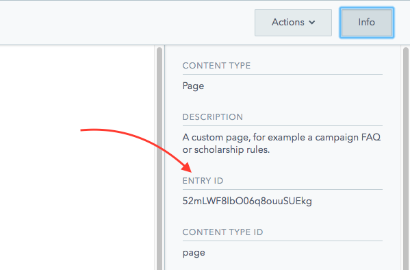

# Campaign Page Modals

1\) Open your Campaign in Contentful.

2\) Find the section called **Pages**.

3\) Open the Page that you want to be referring to as a modal within your Campaign.

4\) When the page is opened, the URL will contain the Contentful ID. In the example below, `52mLWF8lbO06q8ouuSUEkg` is the Contentful ID:

```text
https://app.contentful.com/spaces/81iqaqpfd8fy/entries/52mLWF8lbO06q8ouuSUEkg
```

Alternatively, you can also find the Contentful ID for the page entry, or any entry, by clicking on the **Info** button on the top-right of the entry, which will slide in a panel with addition information about the Contentful entry you are viewing, along with the _Entry ID_:



5\) Use this Contentful ID as a reference for the URL in a Campaign Action or Page that you would like this page to display as a modal, with this URL structure.

```text
/us/campaigns/campaign_name/modal/contentful_id
```

