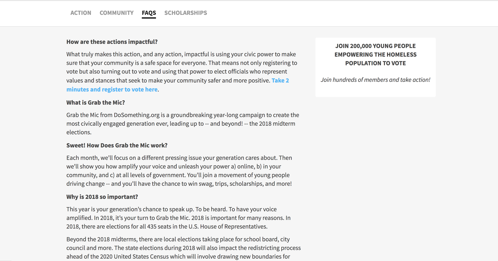
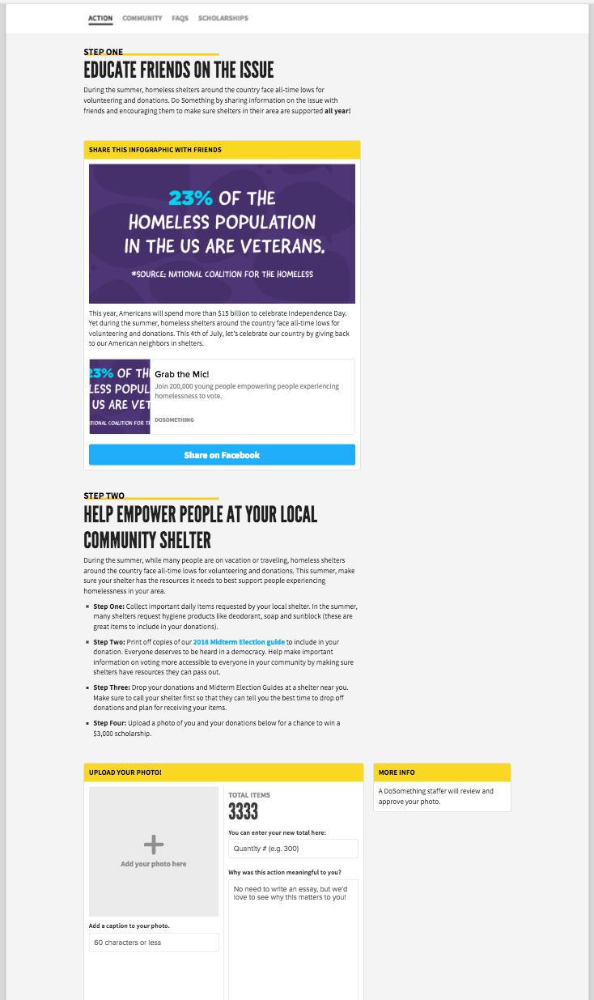

# Campaign Page

To create pages for a campaign use the following steps:

1\) Open your Campaign in Contentful.

2\) Find the section called **Pages** and click **+ Create entry and link**.

3\) Fill in the required fields and any of the optional fields that are needed for the page. Some of the initial fields include:

- **Internal Title** _\(required\)_: should include the title of the campaign, the Year-Month and the title of the page to help find this content in the system. _e.g. Teens For Jeans 2018 Action Page_
- **Title** _\(required\)_: this is the title for the page and will appear in the tab navigation bar on the campaign.
- **Subtitle** _\(optional\)_: This won't show up on the page.
- **Slug** _\(required\)_: this is the slug for the page; this should include the slug for the campaign pre-pended to the slug for the page. So an "Action" page for the "Teens For Jeans" campaign would be `teens-for-jeans/action`.

4\) The **Content** field is optional but should ideally be used for any initial content on the page. If additional blocks are added \(with images or other components\) they can be added in the **Blocks** section and will immediately follow the content in the **Content** field.

5\) The **Sidebar** field is optional and will add sidebar related content to the right of the information in the **Content** field, but only _if_ content was added to the **Content** field. If the **Content** field is left empty, then the **Sidebar** content will not be output on the page.

6\) Add any desired blocks to the **Blocks** field, to expand on the content shown on the page beyond what is in the **Content** field.


For traditional _Action_ or _Community_ pages, the **Blocks** field is the main field you'll be editing. You can add your Action, Content, Campaign Update, etc. blocks to that field.


Example FAQ page for a campaign, utilizing the **Content** and **Sidebar** fields:

Example Action page for a campaign, utilizing the **Blocks** field:

