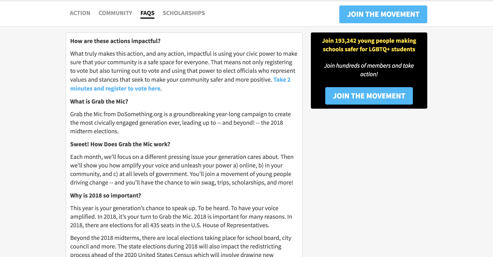

# Adding Campaign Sub Pages

1.  Open your Campaign in Contentful.

2.  Find the section called **Pages**.

3.  Click "Create new entry and link".

4.  Fill in the "Title" field with the desired title _which will also show up in the campaign tabbed navigation bar_ (e.g. `FAQ`)

5.  Fill in the "Slug" field with `campaign-slug/[slug]` e.g. `grab-mic/faq` (You can find the Campaign Slug in the parent campaigns Slug field)

6.  Use the Content editor in the "Content" field to write your FAQs or Scholarship content.

7.  You can click the "Preview" button to see what it will look like before you save it!

A CTA block will be automatically added next to the content on larger screens. (The signup button will not appear for signed up users.)

