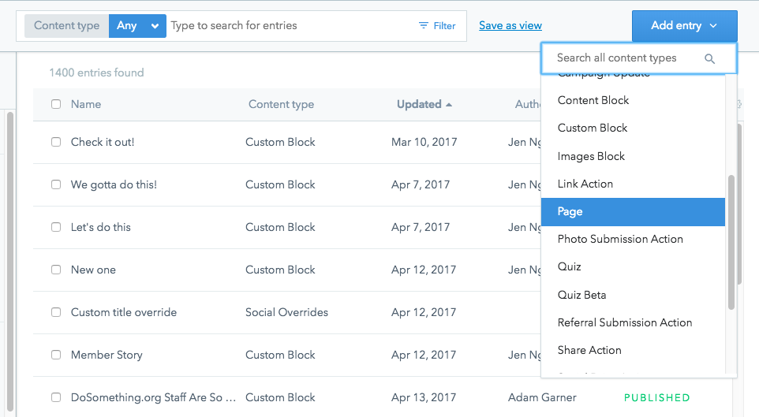
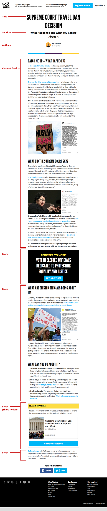

# General Content Page

To create a independent, general content page use the following steps:

1\) In Contentful, head to the **Content** section, and click the **Add entry** button in the top right, and select the **Page** content type.

2\) Fill in the required fields and any of the optional fields that are needed for the page. Some of the initial fields include:

* **Internal Title**: should include the Year-Month and the title of the page to help find this content in the system.
* **Title**: this is the displayed title for the page.
* **Subtitle**: this is the displayed subtitle for the page.
* **Slug**: this is the slug for the page; this field affects the URL address of this content on site, so a slug of `voting-is-cool` would be reached through `www.dosomething.org/us/voting-is-cool`.

3\) The **Content** field is optional but should ideally be used for any initial content on the page. If additional blocks are added (with images or other components) they can be added in the **Block** section and will immediately follow the content in the **Content** field.

4\) The **Sidebar** field is optional and will add sidebar related content to the right of the information in the **Content** field, but only _if_ content was added to the **Content** field. If the **Content** field is left empty, then the **Sidebar** content will not be output on the page.

5\) Add any desired blocks to the **Blocks** field, to expand on the content shown on the page beyond what is in the **Content** field.


For content pages we find Content Blocks, Images Blocks, and Link Actions to work best.
(@todo add links to respective documentation)


6\) Optionally add a [Social Override](../social-overrides.md) to the "Social Override" field.


Once completed, speak with Ashley to setup a redirect to the slug of this page. In order for your awesome General Content Page to be accessible from `dosomething.org/us/your-awesome-content`, some URL redirecting magic needs to be coordinated with the dev-ops team. Please see Ashley or Team Rocket to get this done!


Example general content page without the use of the **Content** field:

