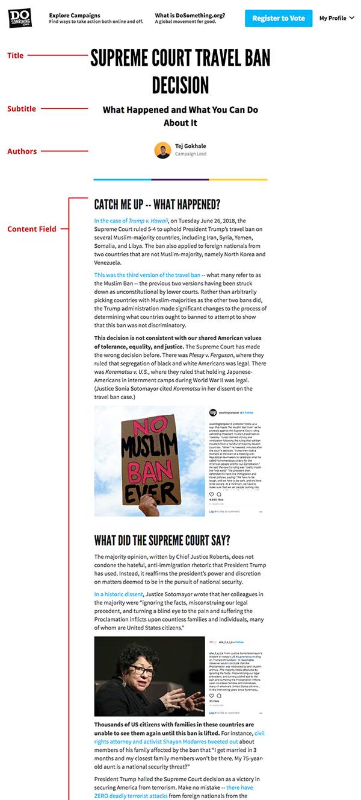
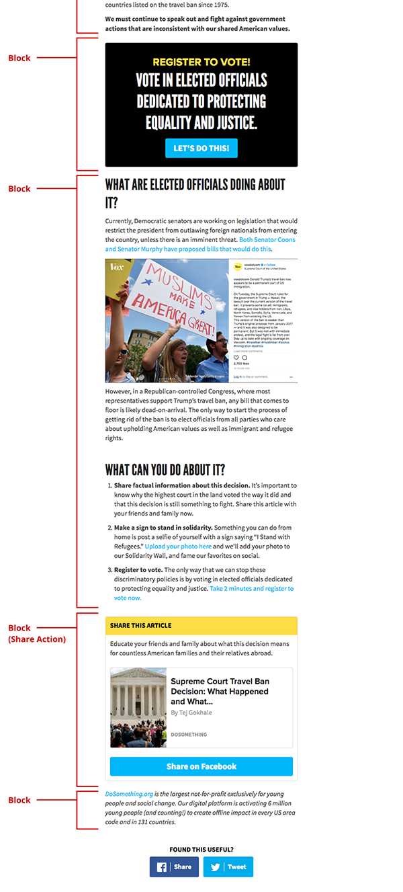

# General Content Page

We're creating a lot of content that isn't campaigns nowadays. These are articles, updates, lists, guides and more. They exist outside the campaign structure and are useful campaign guides as they don't require a user to be signed in or signed up to view. They're also frequently sent out in broadcasts or posted on social media as content pieces to encourage campaign conversion.


In order to use your page in a Link Action, you will need to redirect it from `next.dosomething` to `www.dosomething`. Once you finish editing your page speak with a Product Manager to setup a redirect to the slug of the page. (@TODO remove once Ashes migration is complete.)


## Creating a general content page

### 1. Create the page

In Contentful, head to the **Content** section, and click the **Add entry** button in the top right, and select the **Page** content type.

### 2. Fill out the required fields

There are a number of required fields that you'll need to fill out before you can even save a draft. These are neccesary for the page to exist in our system at all.

- **Internal Title**: This is for our internal Contentful organization and will be how the block shows up in search results, etc. It should include the Year-Month and the title of the page to help find this content in the system.
- **Title**: This is the displayed title for the page.
- **Slug**: This is the slug for the page; this field affects the URL address of this content on site. so a slug of `voting-is-cool` would be reached through `www.dosomething.org/us/voting-is-cool`.


We now support categorizing content pages using a prefix on the slug. So, if a page is meant to be a stand-alone article, editors should use the `articles/` prefix. So for the prior example, since we would want the "Voting is Cool" content as an article on the website, the slug should actually be `articles/voting-is-cool` and reached at `www.dosomething.org/us/articles/voting-is-cool`.

Supported categories currently include, `articles/`, `facts/` and `about/`.


### 3. Add your content

Your page will have other blank fields you can use for your content. All of these fields are optional.

- **Authors**: Include an author for the page; up to 2 authors can be added to a page.
- **Subtitle**: This is the displayed subtitle for the page.
- **Content**: A field that can be used for any initial content on the page; ideally use this field first for any content. If you want to intersperse the content with actions or other blocks then additional blocks are added \(with images or other components\) in the **Blocks** section and will immediately follow the content in the **Content** field.
- **Sidebar**: A field for pages appearing on campaigns like FAQs and Scholarships, this field is will add sidebar related content to the right of the information in the **Content** field, but only _if_ content was added to the **Content** field. If the **Content** field is left empty, then the **Sidebar** content will not be output on the page.


It is not necessary to add **authors** if a page is meant to be a campaign subpage. Only add authors for standalone article pages, or pages where including the author makes sense.


**Adding additional blocks**  
Add any desired blocks to the **Blocks** field, to expand on the content shown on the page beyond what is in the **Content** field. This is where you can add Link Actions and Image Blocks. If you're writing an article that contains a lot of media you'll probably end up threading Link Actions and Content Blocks.


For content pages we find Content Blocks, Images Blocks, and Link Actions to work best. \(@todo add links to respective documentation\)


### 4. Optionally add a [Social Override](../social-overrides.md) to the "Social Override" field.

A social override will change the default image, text blurb and title when the page url is shared on a social network or used in a Link Action. We have a separate page for adding a social override [here](../social-overrides.md).

### 5. Talk to Product Manager to redirect the page

Once completed, speak with a Product Manager to setup a redirect to the slug of this page. In order for your awesome General Content Page to be accessible from `dosomething.org/us/category-prefix/your-awesome-content`, some URL redirecting magic needs to be coordinated with the dev-ops team. Please see a PM or Team Rocket to get this done!

This is an example general content page that uses the **Content** and additional **Blocks** field:

