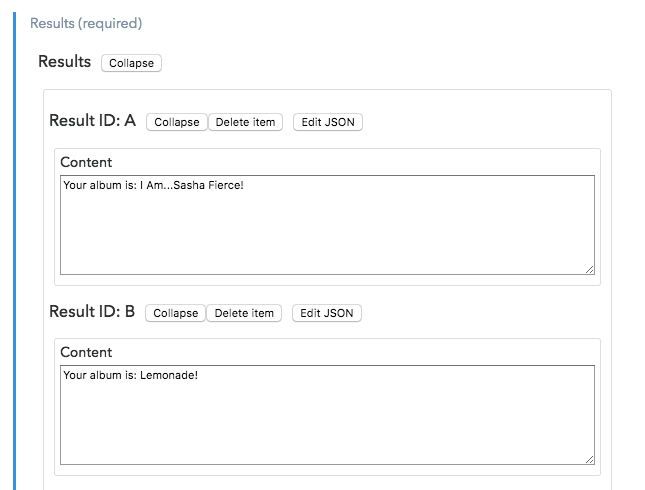
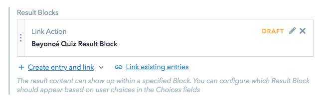
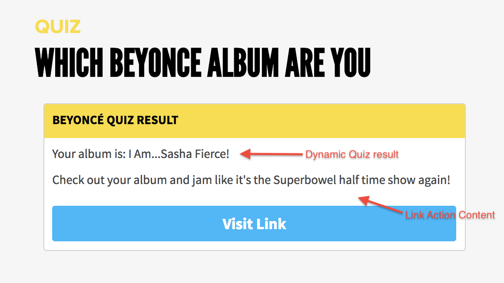
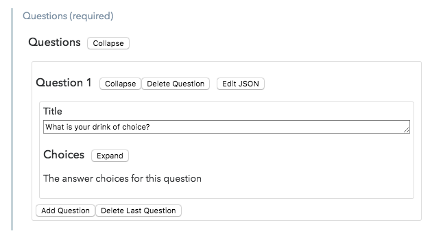
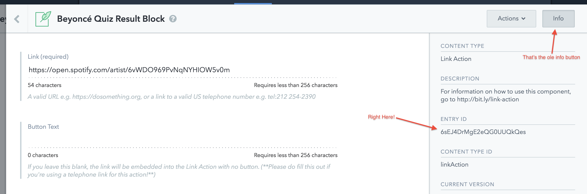
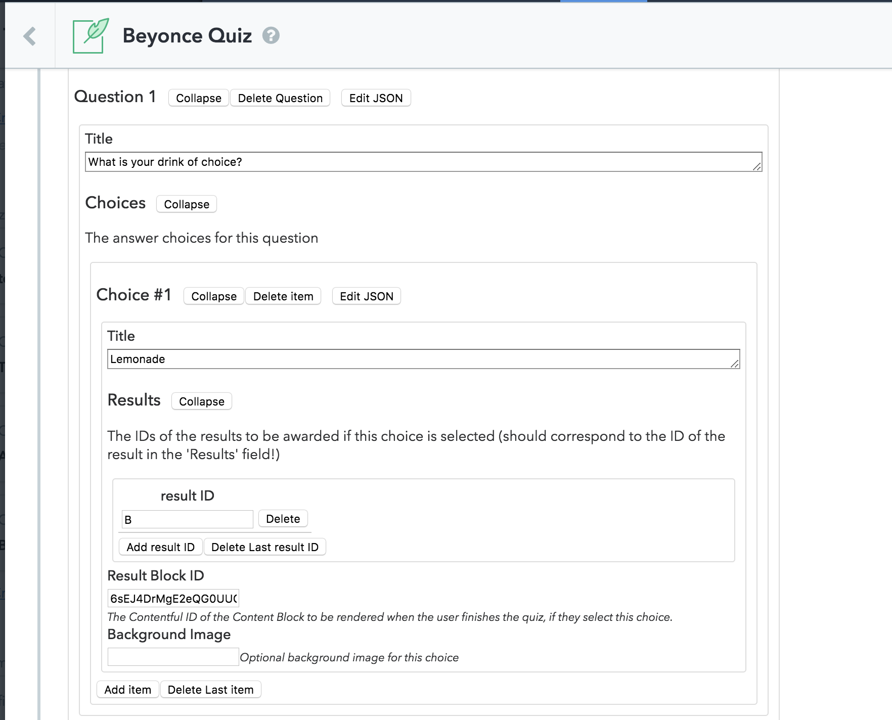
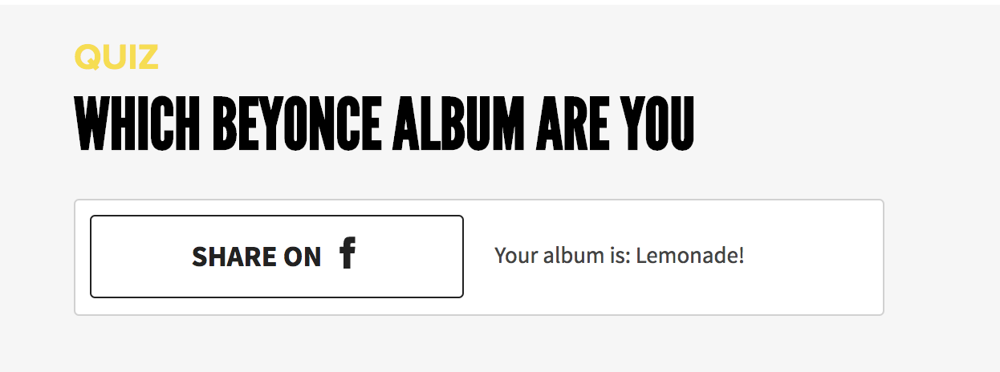

# Quiz

The **Quiz** component is a results-based quiz inspired by the _BuzzFeed_ personality quiz format. We use the Quiz to promote campaigns, drive traffic, and engage our members around issues that matter. It's somewhat involved to build correctly, but we'll attempt to keep it as simple and clear as we can. So, as the youths say: let's get quizzin'!

## Quiz Results

The first thing you'll want to do is assemble a list of quiz results. This step is super important, and is the crux of the entire quiz! To get started with this, you may want to ask yourself:

> What is the bigger question that we want to address with this quiz?".

A somewhat cheerful example might be: "Which Beyoncé album are you?". Once we have this core question crystallized, we can quickly assemble a pool of results -- in our example, this would be the full list of Beyoncé albums.

Once you have your results all listed out, we can start to figure out how we're going to lead the user to the proper result based on our quiz questions and choices.

But first, let's quickly chat about the difference between the **Results** and **Result Blocks** Quiz fields.

### Results

The **Results** field is the core result content that you want to display to the user once they've completed the quiz (i.e., filled out all the quiz questions). A piece of result content might be: "Your Beyoncé album is: I Am...Sasha Fierce" for the old school fan. We'd add _all_ the potential results -- namely the full list of the Bey's albums -- each to a new Result item in the **Results** field.


You may notice that we auto-append a Result ID (A, B, C...) to each result you add. This is no accident, and we'll discuss it's importance later on.


### Result Blocks

Result Blocks are any content type within which you want to present the users result content. This could be a [Link Action](actions/link-action.md), [Share Action](actions/share-action.md), you name it! Simply add the desired entries to the **Result Block** field to have them available for the quiz.

In our fine example, this might mean us attaching a Link Action to the Result Block field. We might fill in the Link Action **Content** field with "Check out your album and jam like it's the Superbowl halftime show again!". Now, whichever result is the winner will be appended to the beginning of the Link Action Content. So in our example, this could turn out as:

## Quiz Questions

Now that we've got our results and result blocks all listed out, it's time to hit the drawing board and start chalking up some Quiz Questions!

### Adding A Question

Head on over to the **Questions** field and let's fill out the first question together. Hit **Add Question** and gleefully add your question to the **Title** field. For our wonderful example, the question will be "What is your drink of choice?".

### Adding Available Choices For Question

Now we can start adding "Choices" to our question. This part is critical, so let's do this properly:

1\) First we add the choice content to the **Title**. We're adding "Lemonade." Simple.

2\) Here's the tricky part -- we now need to add all the IDs of the results we'd like this choice to influence (Remember the ole Result IDs we mentioned earlier??) So for our example, as you may have astutely assumed, we want this selected choice to influence the "Lemonade" album result. We'll pretend we have that in Result ID B and add `B` to the list of Results.

3\) Since we want this to display in that ole Link Action result block, we'll also add the entry ID of the result block -- which can be obtained via the info section of the result block entry page:

Here's how Question 1 is looking for us so far:

### Calculating The Winning Result

Let's take a moment and quickly lay out how the quiz results get calculated:

So we have a list of Results, and optionally -- Result Blocks. Each starts off with 0 points (sad!). Every time the user makes a selection (by selecting a Choice for a Question), we add a point to each Result whos ID is listed in that choices Result IDs.

So in our example, by selecting Choice 1 -- "Lemonade," we'd be adding a point to "Result B" (which was the Lemonade album quite coincidentally).

The same goes for Result Blocks -- selecting a specific choice, adds a point to the Result Block with the Entry ID of the one listed in the Choice.

Once the quiz is completed, we tally for the Result - and if applicable Result Block - with the most points, and append the winning Result Content to the Content field of the winning Result Block, and display it to the user! If there is no Result Block added (it's optional), then we just display the winning result content in a share block like this:


In case of a tie we favor the first result or result block on the list


### Finishing Up

You can now fill out the rest of your questions and choices. You can make this as complex as you want to, though we recommend keeping it dead simple. Sometimes we've found that we only needed _one_ of the questions/choices to influence the quiz result, with the rest of the questions merely colorful adornments to ensure a fun experience!

## Usage Instructions

The Quiz consists of the following fields:

* **internalTitle** _\(required\)_: the title used internally to find this component in Contentful; please follow helper text displayed under the field for suggested naming convention.
* **title** _\(optional\)_: the title that will show up atop the Quiz.
* **slug** _\(required\)_: the slug for the quiz. This should be a hyphenated address, e.g., `beyonce-quiz`. This is the address through which the quiz will be reached, e.g. `https://dosomething.org/us/campaigns/example-campaign/quiz/beyonce-quiz`.
* **autoSubmitQuiz** _\(required\)_: if set to _Yes_, the quiz will auto submit when all questions are completed. If set to _No_, there will be a submission button, _and the quiz result will be gated (only accessible post authentication), and completion will result in campaign signup for the user_
* **hideQuestionNumber** _\(optional\)_: toggle to show the question number atop the questions (e.g., Question One)
* **results** _\(required\)_: the list of results for the quiz.
  * **content** _\(required\)_: The content field for the results
* **resultBlocks** _\(optional\)_: the entries within which the results will be returned.
* **questions** _\(required\)_: the questions for the quiz.
  * **title** _\(required\)_: the question title.
  * **choices** _\(required\)_: the available choices for the question.
    * **title** _\(required\)_: the title for the choice.
    * **results** _\(optional\)_: the list of result IDs to be influenced by the choice.
      * **resultId** _\(required\)_: the ID of the result to be influenced. (You can find the ID next to the desired result in the Quiz **Results** field).
    * **resultBlockId** _\(optional\)_: the Entry ID of the Result Block to be influenced.
    * **backgroundImage** _\(optional\)_: the asset URL of the background image for this choice. _this must be a valid Contentful image URL (you can find this on the asset in Contentful) it should start with `https://images.ctfassets.net...`_
* **additionalContent** _\(required\)_: used to specify additional options in JSON format.
  * **callToAction** _\(required\)_: the text to be displayed next to the quiz submission button. _this is required for non-auto submitted quizzes_.
  * **introduction** _\(optional\)_: intro text for the quiz, displayed under the quiz title.

## Coming Soon

* Quiz Logic Jumping
* Clearer instructions for background images
* Clearer instructions regarding auto submit
