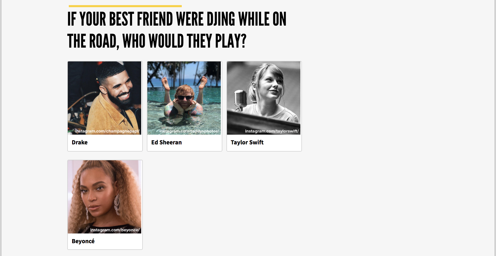
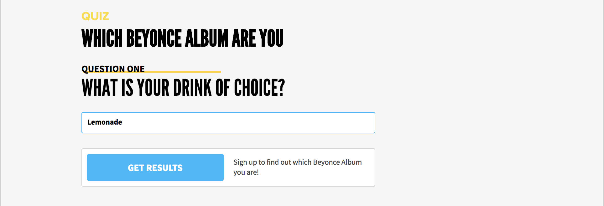

# Quiz

The **Quiz** component is a results-based quiz inspired by the _BuzzFeed_ personality quiz format.

We use the Quiz to promote campaigns, drive traffic, and engage our members around issues that matter. It's somewhat involved to build correctly, but we'll attempt to keep it as simple and clear as we can.

_So, as the youths say: let's get quizzin'!_

## Quiz Results

The first thing you'll want to do is assemble a list of _quiz results_. This step is super important, and is the crux of the entire quiz! To get started with this, you may want to ask yourself:

> What is the bigger question that we want to address with this quiz?".

A somewhat cheerful example might be:

> "Which Beyoncé album are you?".

Once we have this core question crystallized, we can quickly assemble a pool of results -- in our example, this would be the full list of Beyoncé albums.

1.  [Dangerously in Love](https://en.wikipedia.org/wiki/Dangerously_in_Love)
2.  [B'Day](https://en.wikipedia.org/wiki/B%27Day_%28Beyonc%C3%A9_album%29)
3.  [I Am... Sasha Fierce](https://en.wikipedia.org/wiki/I_Am..._Sasha_Fierce)
4.  ...

Once we have our results all listed out, we can start to figure out how we're going to lead the user to the proper result based on quiz _questions_ and _question-choices_.

But first, let's quickly chat about the difference between the **Results** and **Result Blocks** Quiz fields.

### Results

The **Results** field is the core result content that you want to display to the user once they've completed the quiz \(they complete the quiz by filling out all the quiz questions\). A piece of result content might be:

> "Your Beyoncé album is: I Am...Sasha Fierce"

We'd add _all_ the potential results \(which we've already assembled\) -- namely the full list of the Bey's albums -- each to a new Result item in the **Results** field.


You may notice that we auto-append a Result ID \(A, B, C...\) to each result you add. This is no accident, and we'll discuss it's importance later on.


### Result Blocks

**Result Blocks** are any content block within which you want to present the users _result content_. This could be a [Link Action](actions/link-action.md), [Share Action](actions/share-action.md), you name it! Simply add the desired entries to the **Result Block** field to have them available for the quiz.

Here we add a Link Action as one of the result blocks:

In our fine example, we've attached a **Link Action** to the **Result Blocks** field. We might fill in the Link Action's **Content** field with

> "Check out your album and jam like it's the Superbowl halftime show again!".

The winning **result** will be appended to the beginning of the Link Action **Content**. So in our example, this would turn out as:

## Quiz Questions

Now that we've got our **results** and **result** **blocks** all listed out, it's time to hit the drawing board again and start chalking up some **Quiz Questions**!

### Adding A Question

Head on over to the **Questions** field and let's fill out the first question together. Hit **Add Question** and add your question content to the **Title** field. For our example, the question will be

> "What is your drink of choice?".

### Adding Available Choices For Question

Now we can start adding **Choices** to our question. This part is critical, so let's do this properly:

1\) First we add the choice content to the **Title** field. We're adding _"Lemonade."_ Simple.

2\) Here's the tricky part -- we now need to add all the **Result IDs** of the **results** we'd like this choice to influence \(Remember the **Result IDs** we mentioned earlier??\) So for our example -as you may have astutely assumed- we want this selected **choice** to influence the _"Lemonade"_ album **result**. If we have that in **Result ID B** we'll add `B` to the list of Results.


If this is confusing, check out the _Quiz Question_ image \_\_below step 3


3\) Since we want this to display in that **Link Action**'s **result block**, we'll also add the entry ID of the result block -- which can be obtained via the info section of the result block entry page -- to the **Result Block ID** field.

Here's the **Result Block**, we're pasting the **Entry ID** into the **Result Block ID** field:

Here's how Question 1 is looking for us so far:

### Calculating The Winning Result

Let's take a moment and quickly lay out how the quiz **results** get calculated:

So we have a list of **Results**, and optionally -- **Result Blocks**. Each starts off with **0** **points** \(sad!\). Every time the user makes a selection \(by selecting any **Choice** for a quiz **Question**\), we add a point to each **Result** with a **Result ID** listed in that choices **Result IDs** field.

So in our example, by selecting _Choice 1 -- "Lemonade,"_ we'd be adding a point to _"Result B"_ \(which was the Lemonade album quite coincidentally\).

The same goes for **Result Blocks** -- selecting a specific choice, adds a point to the **Result Block** with the **Entry ID** of the one listed in the Choice's **Result Block ID** field.

Once the quiz is completed, we tally for the **Result** - and if applicable **Result Block** - with the most points, and append the winning **Result Content** to the **Content** field of the winning **Result Block**, and display it to the user! If there is no **Result Block** added \(it's optional\), then we just display the winning result content in a share block like this:


In case of a tie we favor the first **result** or **result block** on the winning list.


### Finishing Up

You can now fill out the rest of your **Questions** and **Choices**. You can make this as complex as you desire, though we recommend keeping it as dead simple as possible. Sometimes we've found that we only needed _one_ of the questions/choices to actually influence the quiz result, with the rest of the questions merely colorful adornments to ensure a fun experience!

## More Quiz Fun

### Background Images

For each Quiz **Choice,** you can add a **Background Image URL**, to decorate the choice:

You can do this by filling out the **Choices - Background Image** field with a valid Contentful Asset URL for the desired image:

1.  Add the image to the Contentful Asset suit
2.  Visit the Asset entry from the **Contentful Media** section
3.  Hover over the **File** field of the asset and click the **Download File** button
4.  The file will then open in a new tab
5.  Copy the URL of that new tab
6.  Paste that URL in the **Choices - Background Image** field**.**

Yes, unfortunately for the time being, these steps are somewhat tedious and involved, but on the \#mrBrightside you do get super fresh looking **Quiz Choices!**

### Auto Submit

The **Auto Submit Quiz** field affects how the User proceeds to the **Results** once the Quiz questions are completed.

If set to **True**, once the user completes the final question, the quiz will proceed to process and display the **Results** _automatically._

If set to **False**, The quiz will be equipped with a **Get Results** CTA button at the bottom, which will be clickable once the user completes all questions:


The **Get Results** button text is editable via the \`addtionalContent.submitButtonText\` field.

The **CTA** text is editable via the \`additionalContent.callToAction\` field \(which is required for a _non_ auto submittable quiz!\)


**Super Important:**

For a _non_ auto submittable quiz, the **results** will be **gated**, which means that they will be auto signed up for the Campaign the quiz belongs to when they click the **Get Results** button. If they're not authenticated, they will be redirected to the **Northstar** authentication flow at https://identity.dosomething.org before being proceeded to the **results.**

### Logic Jumping

A cool feature of the quiz is the ability to lead the user not to a regular **result** in some **action block**, but to actually jump them to another quiz!

You can think of this as a sort of "Choose Your Adventure" style functionality, where based on the **Choices** they make they are led to a specific nested quiz, which in kind can lead them to a regular result, or even a second level of nested quizzes...

A good example of this might be a Quiz we ran for the **Brake it Down** campaign, where we first bucketed the quiz takers as **Drivers**, **Passengers**, or **Pedestrians** based on how they answered the first quiz, and then led them to the next nested quiz based on their bucket. The nested quiz would then lead them to a specific persona result, based on how they answered for that nested quiz.

#### Adding a logic jump

To add a logic jump, simply add the nested quiz blocks to the **Result Blocks** field and set the appropriate **Choice Result Block ID** fields as you would any other Quiz **result block**!

The only extra step you need to take is to attach the nested quiz to the parent Campaign's **Quizzes** field.

## Usage Instructions

The Quiz consists of the following fields:

- **internalTitle** _\(required\)_: the title used internally to find this component in Contentful; please follow helper text displayed under the field for suggested naming convention.
- **title** _\(optional\)_: the title that will show up atop the Quiz.
- **slug** _\(required\)_: the slug for the quiz. This should be a hyphenated address, e.g., `beyonce-quiz`. This is the address through which the quiz will be reached, e.g. `https://dosomething.org/us/campaigns/example-campaign/quiz/beyonce-quiz`.
- **autoSubmitQuiz** _\(required\)_: if set to _Yes_, the quiz will auto submit when all questions are completed. If set to _No_, there will be a submission button, _and the quiz result will be gated \(only accessible post authentication\), and completion will result in campaign signup for the user_
- **hideQuestionNumber** _\(optional\)_: toggle to show the question number atop the questions \(e.g., Question One\)
- **results** _\(required\)_: the list of results for the quiz.
  - **content** _\(required\)_: The content field for the results
- **resultBlocks** _\(optional\)_: the entries within which the results will be returned.
- **questions** _\(required\)_: the questions for the quiz.
  - **title** _\(required\)_: the question title.
  - **choices** _\(required\)_: the available choices for the question.
    - **title** _\(required\)_: the title for the choice.
    - **results** _\(optional\)_: the list of result IDs to be influenced by the choice.
      - **resultId** _\(required\)_: the ID of the result to be influenced. \(You can find the ID next to the desired result in the Quiz **Results** field\).
    - **resultBlockId** _\(optional\)_: the Entry ID of the Result Block to be influenced.
    - **backgroundImage** _\(optional\)_: the asset URL of the background image for this choice. _this must be a valid Contentful image URL \(you can find this on the asset in Contentful\) it should start with_ `https://images.ctfassets.net...`
- **additionalContent** _\(required\)_: used to specify additional options in JSON format.
  - **callToAction** _\(required\)_: the text to be displayed next to the quiz submission button. _this is required for non-auto submitted quizzes_.
  - **introduction** _\(optional\)_: intro text for the quiz, displayed under the quiz title.
  - **hideTitle** _\(optional\):_ If set to **true**, the Quiz **title** field will be hidden.
