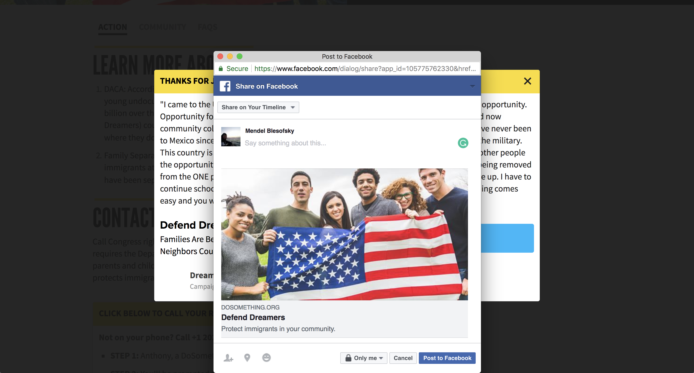
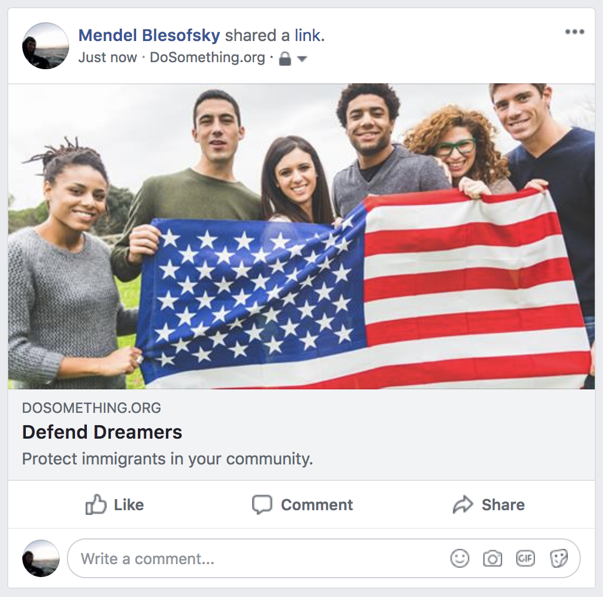
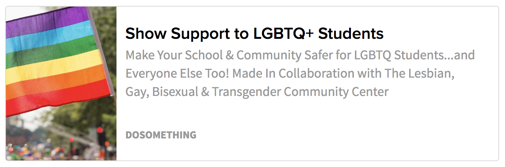

# SEO & Metadata

There are certain times throughout the DoSomething.org experience, where a user might see a visual preview of some destination URL or link. These include:

When a user clicks one of our assorted Facebook share buttons, they'll see the link preview embed in the Facebook editor.

When a user shares a link to social media \(Twitter, Facebook etc.\), the embed will be visible:

Any link embed on our site; be it a Share Action, Link Action, Campaign Update, etc...

----

This social information and SEO content is managed with the **Metadata** content type. This feature is the updated version of **Social Overrides**, has a wider support for important SEO fields. We allow for **Metadata** content to be added to Campaigns, Pages and Campaign Updates.

When you add descriptions, titles and images to the **Metadata** block attached to a page, you’re actually placing invisible descriptors and links in the page code. When Facebook, Twitter or another site take a look at the page though an embedded link, it uses the code the Metadata block provides. This way you can use different photos for Facebook than the article header, or a custom description for a campaign page.

You can create **Metadata** objects directly from any of the supported content types:

### 1\) Open your entry in Contentful and find the **Metadata** field
When you click **+ Create entry and link** you'll be taken to a new **Metadata** object.

### 2\) Fill in the fields with the information you want shown on the embed.
We've been able to optimize the Metadata content type to work with Mozilla's recommended SEO guidelines with a small number of fields.

- **Internal Title**: This is for our internal Contentful organization and will be how the block shows up in search results, etc. It should include the Year-Month and the title of the page to help find this content in the system.
- **Title**: This will be displayed as the headline when embedded and previewed on other sites.
- **Description**: This field will most often be styled as smaller text underneath the title. Mozilla and other experts recommend for this to be about 160 characters.
- **Image**: This image will be displayed alongside the title and description. Implementation differs from site to site, please see the attached image for guidance. The default size should be 1200x1200px with centered content.

Even if you don’t have many changes, you should try to fill out all the fields to help with SEO. We make as many smart guesses as possible with page default fields, but it’s best to be specific. For instance, if there’s no image provided we fall back to the campaign/article cover photo. If there is no cover photo provided, we fall back to the DS logo in a black square.

The recommended size for an image is 1200x1200 with the focus placed in a the center. Some sites like Pinterest, Reddit and embeds like Slack will use the full square photo, but Facebook and Twitter will create a cropped version out of the center. 

### 3\) Publish the Metadata object
After you've filled out the form, publish the **Metadata** object and save your parent page. If you'd like to preview how your parent page will show up with the new metadata, you can use the [Facebook Sharing Debugger](https://developers.facebook.com/tools/debug/sharing/).

Here's the example embedded link, with the corresponding **Metadata** fields:

