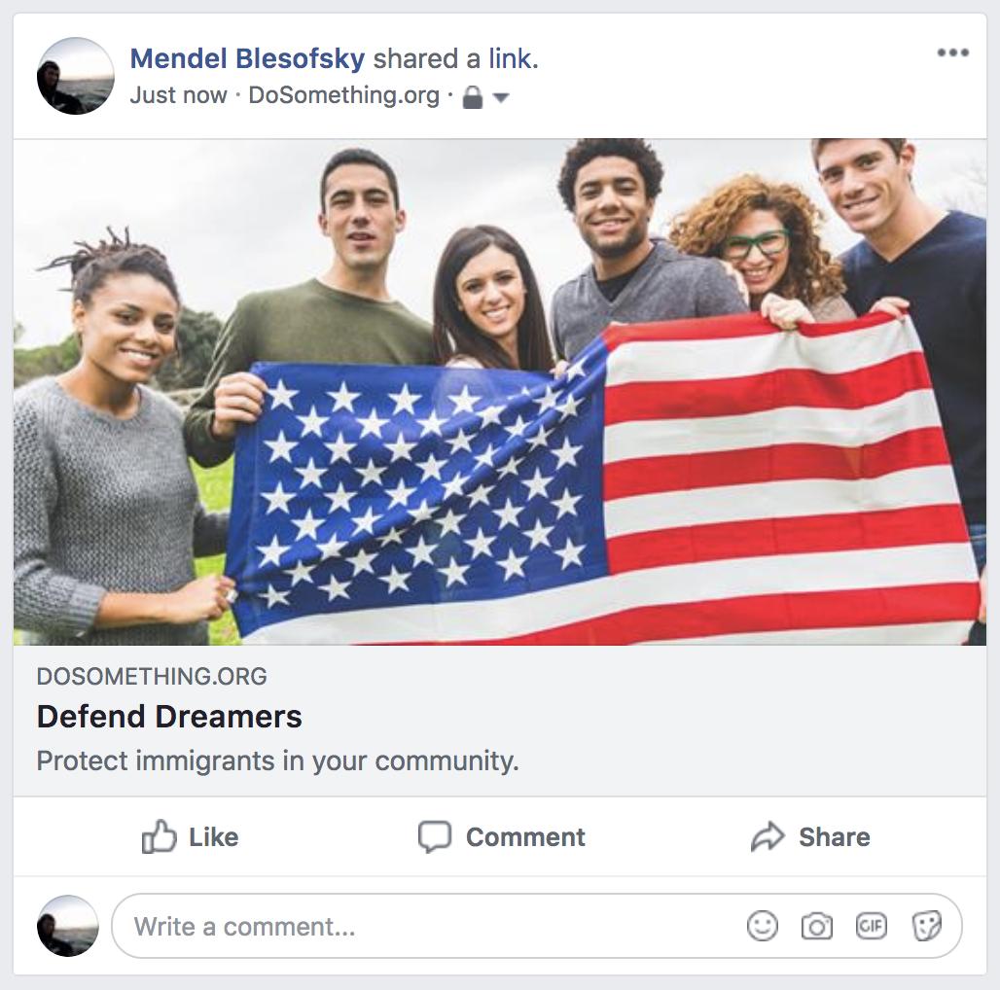
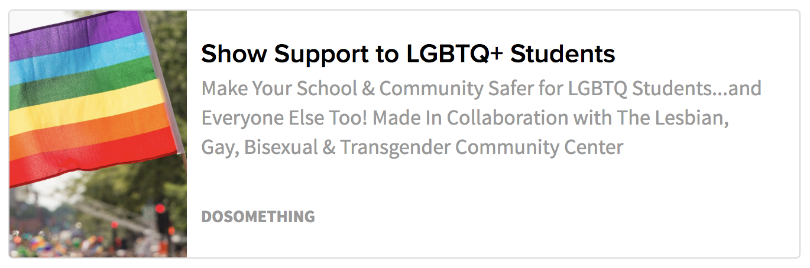
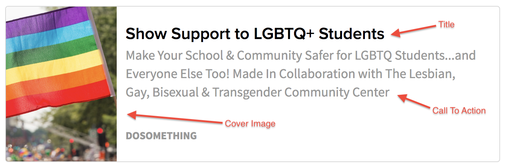

#Social Overrides

There are certain times throughout the DoSomething.org experience, where a user might see a preview of some destination URL or link.

This includes:

* _when clicking one of our assorted Facebook share buttons, they'll see the link preview embed in the Facebook editor:_

* _when actually sharing the link to social media (Twitter, Facebook etc.), the embed will be visible:_

* _in any link embed on our site, be it a Share Action, Link Action, Campaign Update, etc._

We allow the option of editing this embedded content using the "Social Override" field on **Campaigns**, Content **Pages**, and **Campaign Updates**.

In any of the above mentioned Content Types, to create a Social Override:

1.  Open your entry in Contentful
2.  Find the field that's called "SOCIAL OVERRIDE"
3.  Click "Create new entry and link"
4.  Click the pencil to edit
5.  Fill in the fields with the information you want shown on the embed!

Here's the example embedded link, with the corresponding Social Override fields:

