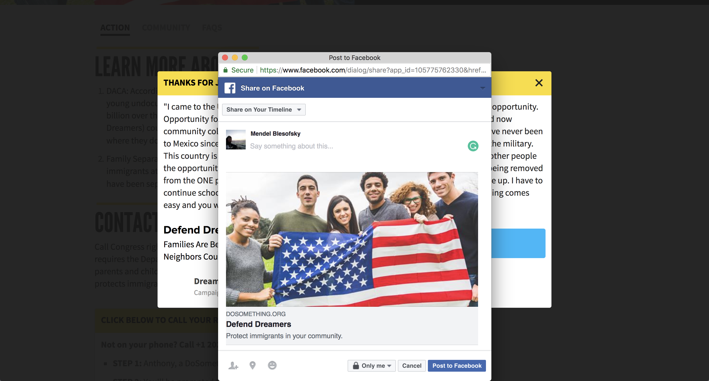
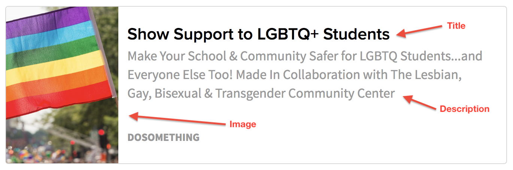

# Social Overrides

There are certain times throughout the DoSomething.org experience, where a user might see a visual preview of some destination URL or link. These include:

When a user clicks one of our assorted Facebook share buttons, they'll see the link preview embed in the Facebook editor.

When a user is shares a link to social media (Twitter, Facebook etc.), the embed will be visible:

Any link embed on our site; be it a Share Action, Link Action, Campaign Update, etc...

We allow the option of editing this embedded content using the **Social Override** field on Campaigns, Pages, and Campaign Updates.

In any of the above mentioned content types, to create a Social Override:

1\) Open your entry in Contentful.

2\) Find the **Social Override** field and click **+ Create entry and link**.

3\) Fill in the fields with the information you want shown on the embed.

4\) The **Quote** field is only used on the Facebook share editor.

Here's the example embedded link, with the corresponding Social Override fields:

