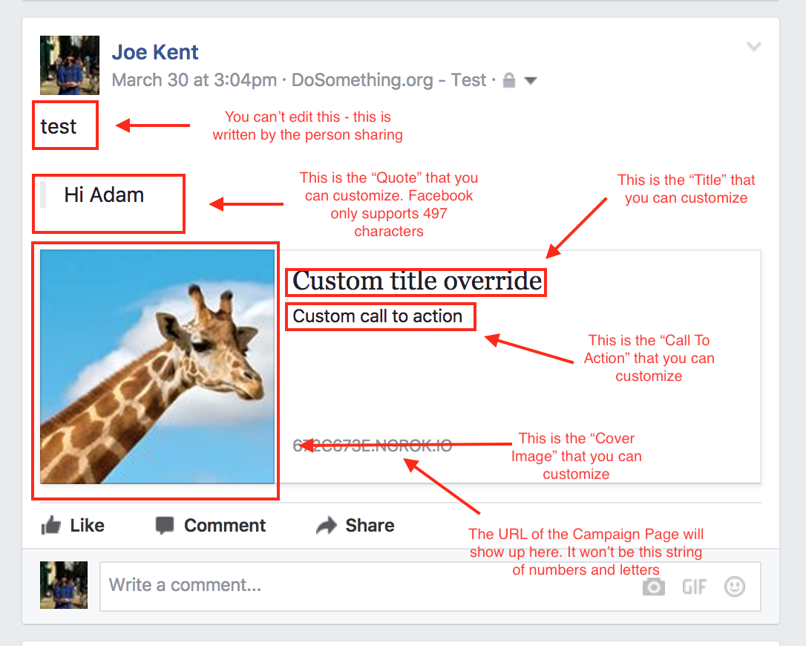

# Social Overrides

This is how you edit the information that shows up in the Facebook post. The Facebook share is sharing the entire campaign page, so if someone clicks on the post it will bring them to the campaign page, not a specific block.

The Facebook buttons on each block will take them to the specific block, but if you want to add special overrides for specific blocks you can follow this same procedure, just use the custom share in the block rather than on the full campaign.

If you don't customize the Facebook share, it will just default to the campaign page information.

The two locations that a user can share from is the **Affirmation Component** \("Thanks for Joining" that pops up post-affiliation\) and in the **Dashboard** if the campaign contains a dashboard.

1.  Open your campaign page in Contentful
2.  Find the section that's called "SOCIAL OVERRIDES"
3.  Click "Create new entry and link"
4.  Click the pencil to edit
5.  Fill in the fields with the information you want shown on the Facebook post!

Here's a breakdown of what each of the fields on the edit page refers to on the Facebook share post. This is what the post looks like when it's shared on Facebook:

