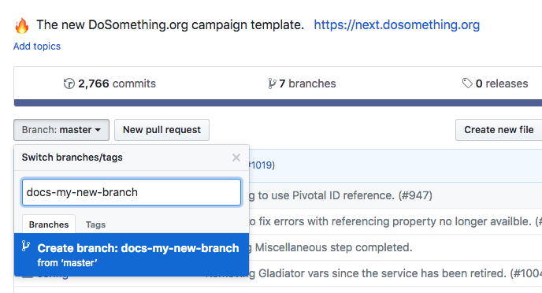
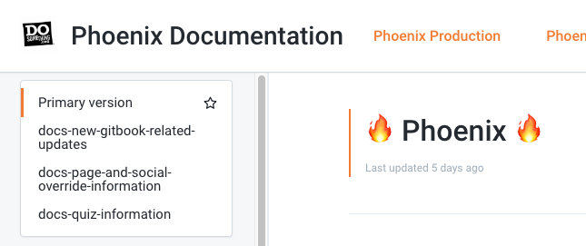
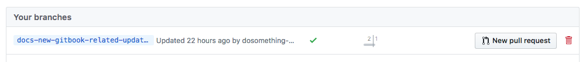

# Getting Started

The documentation for Phoenix is generated from the `/docs` directory in the Phoenix repository using [GitBook](https://www.gitbook.com/).

You can contribute to editing this documentation in two ways.

## Edit Using GitBooks UI


Make sure you have a GitBooks account and that your account has been added as a team member to the Phoenix Documentation!


You will need to create a new branch on [GitHub](https://github.com/) and prefix the name of the branch with `docs-`.

Sign into your GitBooks account and if you have the correct permissions you should be able to edit the documentation.

Select the branch name you created for your edits using the dropdown menu on the top left of the GitBooks interface.

You are now free to edit the documentation using the interface tools GitBooks provides. Your edits will automatically sync with the branch you created on GitHub.

Once completed, head to [GitHub Phoenix Branches](https://github.com/DoSomething/phoenix-next/branches) and click to create a pull request from the branch you created.

Once the pull request is reviewed, approved, and merged, you will see your contributions on the **Primary version** of the Phoenix Documentation.

## Edit Files Locally

Clone the [Phoenix repository](https://github.com/DoSomething/phoenix-next), create a new branch and edit the `/docs` files locally. Please make sure to follow similar formatting and structure to what has already been established.

Once your edits are complete, submit a pull request with your contributions.

If you would like to preview how your edits show up on the rendered GitBooks documentation, you can prefix `docs-` to the name of the branch for the pull request, and GitBooks will automatically include this as a selectable version of the documentation from the dropdown menu on the top left of the GitBooks interface. With each commit you push up to your branch, GitBooks will sync and show you the updates visually.

Once the pull request is reviewed, approved, and merged, you will see your contributions on the **Primary version** of the Phoenix Documentation.


So that GitBook generates the documentation properly and converts the markdown to HTML, you need to always ensure that with every new page you add, you include a corresponding entry to the `/docs/SUMMARY.md` file.



All links in a file are relative to that file's location in the directory structure.



All image assets are stored in a hidden directory in `/docs/.gitbooks/assets/`.

