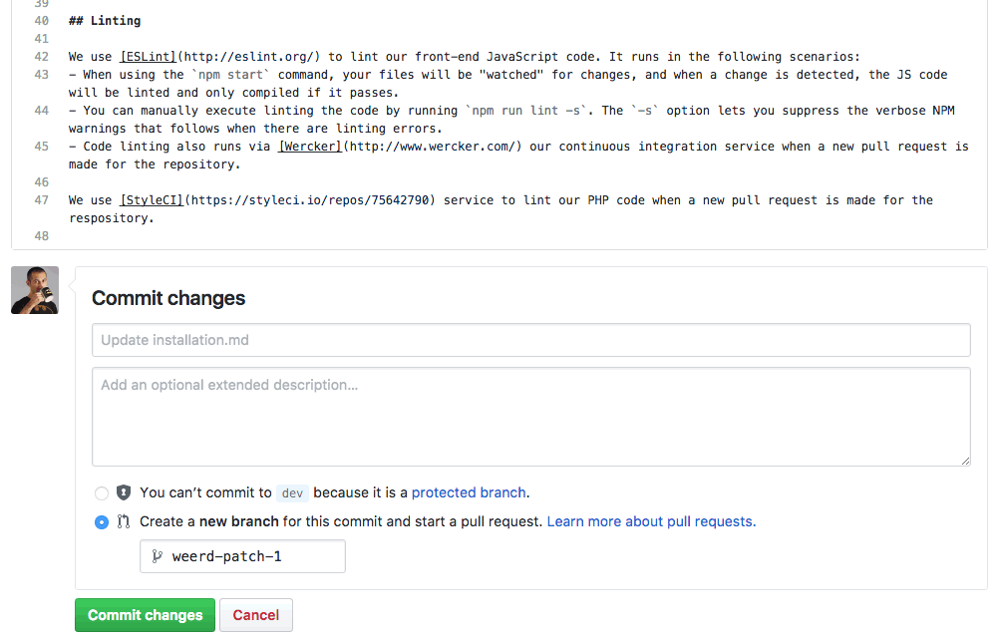

# Editing Docs On GitHub

You can use GitHub's interface to create or edit documentation files.

## Creating A New File

When creating a new file, make sure to specify the directory path in the input that GitHub provides at the top.

## Editing An Existing File

## Committing An Edit

After committing your edit, request a review of the change and once approved you can merge the change.
