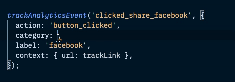

# Analytics

The structure of an analytics event is comprosised of a specified event name and an object providing additional event metadata. The metadata is based on the data structure that our third-party analytics platforms require, which includes the following properties:

- **category**: referenced from a list of approved categories (it should not be created on the fly).
- **action**: defines a specified item/element and describes the action that was taken upon it (e.g. "Button Clicked").
- **label**: additional meta data about the action to help distinguish what it was (e.g. "Register", "Twitter" or "Email", to describe the "Button Clicked" action).
- **context**: object containing all additional desired meta data around an event to help provide data around the full context of the event.
- **service**: specify which third-party service to send the analytics data; defaults to all supported analytics platforms.


When an analytics event is triggered on a page, if the page has UTMs attached to the URL for the page (e.g. `?utm_campaign=teens_for_jeans&utm_medium=email&utm_source=dosomething`), these UTMs are automatically added to the payload in the `context`, so there is no need to manually do this when triggering the event!


## Triggering An Event

You can use the `trackAnalyticsEvent()` helper function to trigger an analytics event from the JavaScript frontend in Phoenix.

Import the function, along with the `EVENT_CATEGORIES` object, which contains a list of approved event categories that can be used to designate a category for the event.

```js
import { EVENT_CATEGORIES, trackAnalyticsEvent } from '../../helpers/analytics';

// Within React component or other JS file:
trackAnalyticsEvent('clicked_signup', {
  action: 'button_clicked',
  category: EVENT_CATEGORIES.signup,
  label: campaignTitle,
  context: {
    campaignId,
    contextSource,
    pageId,
  },
});
```


While it is not necessarily required you use the `EVENT_CATEGORIES` variable to assign the category for an event, we highly recommend it since it helps avoid introducing unapproved categories or typos into the system. Most code editors will provide helpful contextual hints to the available categories when you call the `EVENT_CATEGORIES` variable:




## Day To Day

As a developer, you should receive requests to add new analytics event triggers in a ticket, where it should specify all the relevant information to create an accurate event trigger:

- `name`
- `category`
- `action`
- `label`
- `context`
- `service` _(optional)_


If no `context` information is specified in the ticket, please confirm with the ticket requester that the event trigger does not require any additional context data supplied.

We also recommend reviewing the location where the event trigger is supposed to fire, and considering if there is any potential context data that is available to supply to the `context` object and mention it in the ticket. It could reveal that there is useful information that could help paint a full picture of the event that would be ideal to add to the `context` for analytics.


After adding an event trigger, you can test it in any of our environments by using the **DS Debug** console tool, which can be called in the browser console using the following command:

```js
// Pass an array of services for which to show logs.
window.DS.Debug.enableLogs(['google', 'snowplow']);
```

This will show logs when an analytics event is triggered and let you visualize the structure of the event that is sent to our analytics platforms, so you can confirm the structure is as intended.

Example analytics event console log with DS Debug console tool:


That's about it!
