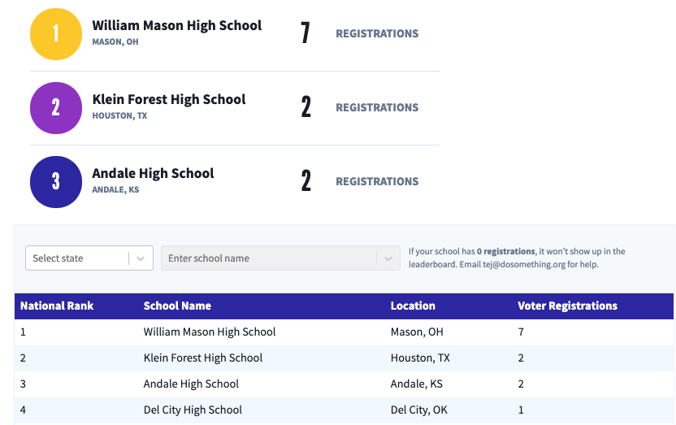

# Action Stats Block

Displays a leaderboard and table of paginated school [action stats](https://github.com/DoSomething/rogue/blob/master/docs/endpoints/action-stats.md) for a given Rogue action.

## Content Type Fields

-   **Internal Title**: This is for our internal Contentful organization and will be how the block shows up in search results, etc.

-   **Action ID**: The ID of the [Action](https://github.com/DoSomething/rogue/blob/master/docs/endpoints/actions.md) to filter a `GET /action-stats` query by.
