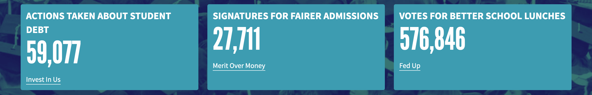

# Company Page

## Overview

Displays a collection of (optional) stats, campaigns and article content revolving around a particular cause space (e.g. education).

📸 [Example cause-page](../../.gitbook/assets/cause-page.jpg).

## Content Type Fields

- **Internal Title**: This is for our internal Contentful organization and will be how the block shows up in search results, etc. (does _not_ display to the user on the page).

- **Slug**: The URL slug, which we prefix with `/causes/`. e.g. `dosomething.org/causes/environment`. _This must be a [valid cause name](https://github.com/DoSomething/rogue/blob/78cfb1abcdd590afd253fb4e9b8d9e83831bbb1f/app/Types/Cause.php) on Rogue since we use this value to query campaign content via Rogue._

- **Cover Image**: Displays as the background image of the banner at the top of the page.

- **Supertitle**: Shows up atop the title in the banner (can be used as a nice prefix to the title) e.g. "Let's do something about the".

- **Title**: Displays right under the Supertitle. This is the title of the page. e.g. "Environment".

- **Description**: The Rich Text description (information/introduction) for this cause page. Displays in the banner below the title.

- **Content**: The Rich Text content of the page. This can be content in markdown format, embedded Assets, or valid embedded entry blocks (preferabely Gallery Blocks).

- **Additional Content** _(optional)_: Displays stat cards in the banner under the description. The stats nead their own distinct color in hexidecimal format aling with an array of three stats. Each stat should contain a _title_, some _text_, and a stat _number_. It should also contain a _link_ to the associated Campaign for this stats with a _url_ and link _text_. Example:

```json
{
  "statsBackgroundColor": "#3D9CB1",
  "stats": [
    {
      "link": {
        "url": "https://www.dosomething.org/us/campaigns/company-student-debt",
        "text": "Invest In Us"
      },
      "title": "actions taken about student debt",
      "number": 59077
    },
    {
      "link": {
        "url": "https://www.dosomething.org/us/stories/legacy-donor-admissions",
        "text": "Merit Over Money"
      },
      "title": "signatures for fairer admissions",
      "number": 27711
    },
    {
      "link": {
        "url": "https://www.dosomething.org/us/campaigns/fed/community",
        "text": "Fed Up"
      },
      "title": "votes for better school lunches",
      "number": 576846
    }
  ]
}
```

Which yields:


## Campaign Gallery

The cause page will automatically pull _open_ campaigns from Rogue associated with this cause space (via the campaign's _cause_ field).

It'll display a paginated gallery of these campaigns atop the content section. (Using the [Paginated Campaign Gallery](../features/paginated-campaign-gallery.md) utility).

## Technical Notes

#### GraphQL

The Cause Page is available as a `CausePage` in GraphQL.
