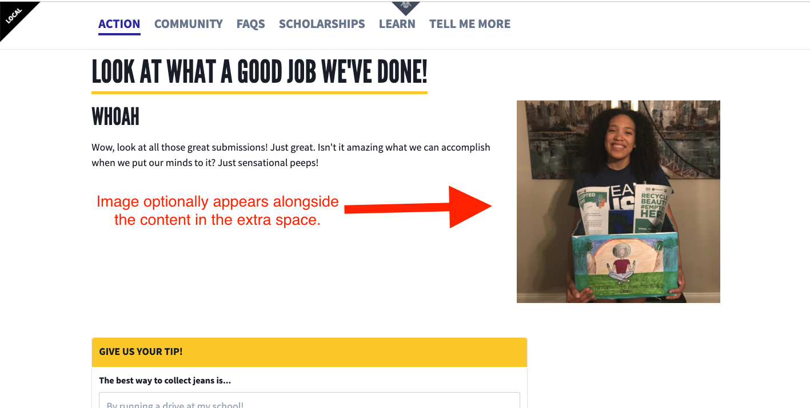
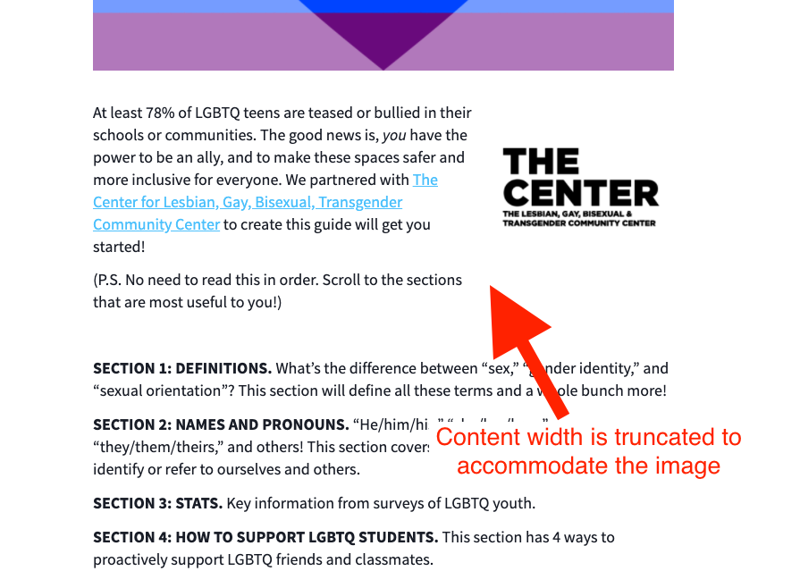

# Content Block

## Overview

Displays supertitle, title, copy, and image. Commonly used to list steps in a campaign.

## Content Type Fields

-   **Internal Title**: This is for our internal Contentful organization and will be how the block shows up in search results, etc.
-   **Supertitle** _(optional)_: The supertitle for the content block which appears in smaller font-size above the title.
-   **Title** _(optional)_: The title for the content block which appears in larger font-size above the content.
-   **Content**: The content for the content block in Markdown format, displayed below the title.
-   **Image** _(optional)_: An accompanying image displayed alongside the content.
-   **Image Alignment** _(optional)_: Controls whether to render the image to the right or left of the content (defaults to right).
-   **Additional Content _(optional)_**: A JSON field, with properties:
    -   `footerType`: Valid values: `VoterWidgetBlock`.

## Content Width Span

By default, the content provided will span two-thirds of the row to accommodate the image in the other third. This works well for e.g. Campaign Pages where we assign extra row space for Content Blocks so that the image can simply appear within the extra space:

But for e.g. General Pages where the content width is truncated to accommodate the image within the natural bounds of the row, we need to ensure that when there is _no_ image provided, the content flows across the _full row_:

The `fullWidth` prop toggles this behavior.

<!-- ## Content Block Gallery Node -->
<!-- @TODO: Add documentation pertaining to the Content Block rendered as a Gallery Block reference. -->
