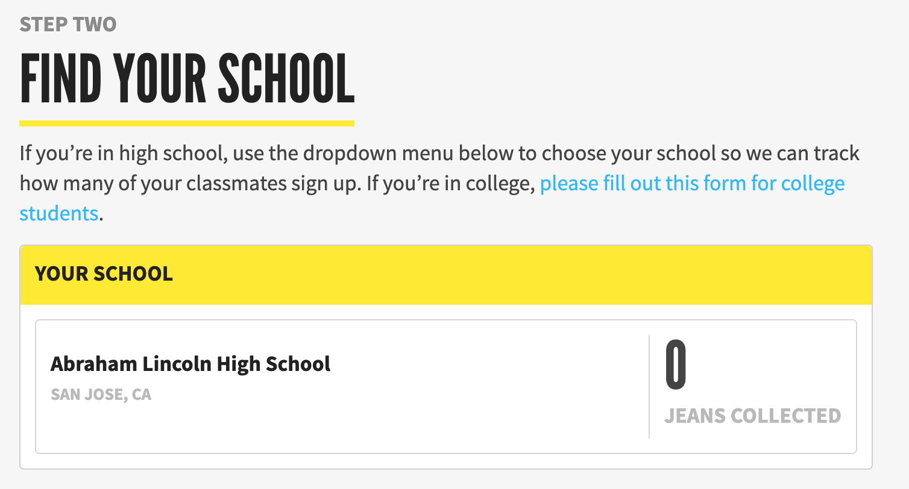

# Content Block

## Overview

Displays headline, subtitle, supertitle, copy, and image. Commonly used to list steps in a campaign.


A `ContentBlock` may also display a [School Finder via its additionalContent field](development/features/school-finder.md#usage-instructions). This is likely temporary if we use this for multiple campaigns, as a new content type would be better for the long-term.



## Technical Notes

- Available aas a `ContentBlock` in GraphQL.

- For now, the `additionalContent` field is used to display a Current School Block. This will be deprecated in the near future, but the expected values are:

```
{
    "showSchoolFinder": true,
    "actionId": 21,
    "schoolFinderFormDescription": "Pick your school and whatever. Invite your classmates to join this campaign and donate their jeans to win prizes and some other stuff.",
    "schoolNotAvailableHeadline": "No School Selected",
    "schoolNotAvailableDescription": "No school copy goes here, please email Sahara with information about your school.",
    "schoolSelectedConfirmation": "Your school total will be updated anytime a submission from someone in your school has been reviewed."
}
```
