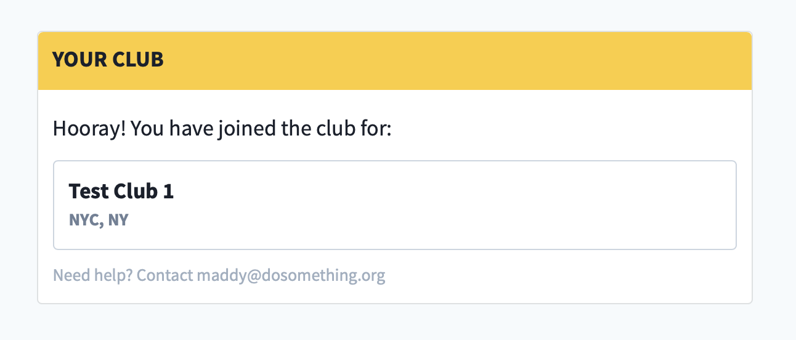
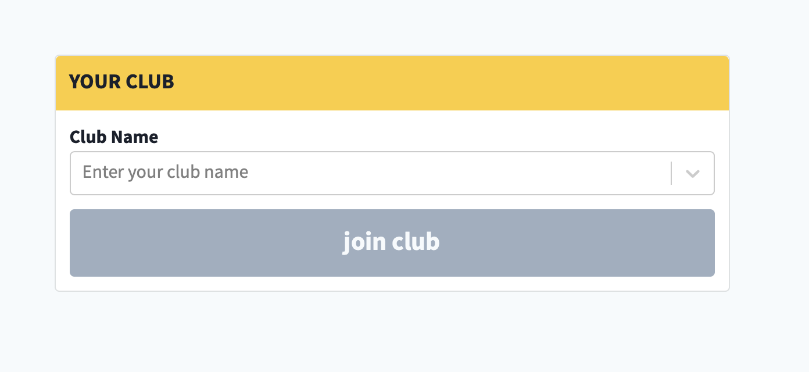

# Current Club Block

## Overview

the Current Club Block Displays the authenticated user's current club (The Rogue Club matching the `club_id` in their Northstar profile).

If the user does not have a `club_id` set on their Northstar profile, or is not authenticated, they are prompted to select their club from an auto-complete drop-down of existing clubs sourced from Rogue. Upon save, the user's Northstar `club_id` field is updated with the selected club, and the user is subscribed to the `clubs` email subscription topic via Northstar.

The form will use 'lazy authentication' for unauthenticated users, allowing them to select their club and then authenticate via Northstar to persist their choice. (If the unauthenticated user already has joined a club, their new selection will _not_ be persisted, and the form will update to display their original club once they authenticate).

## Content Type Fields

-   **Internal Title**: This is for our internal Contentful organization and will be how the block shows up in search results, etc.
