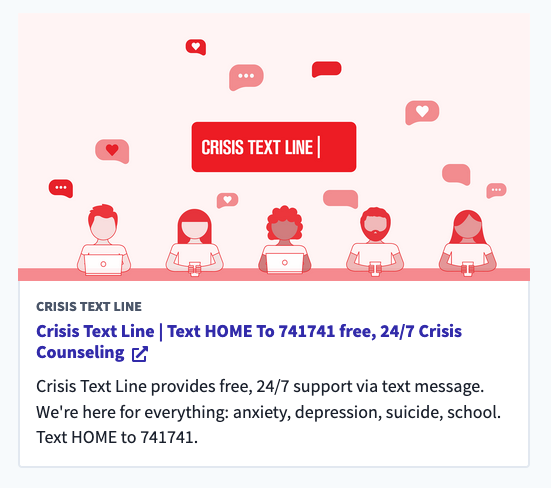

# External Link

## Overview

The External link renders a click-able card linking to an external URL. It fetches (via GraphQL) and displays the provider title, description, and image which can all be overriden via Contentful.

## Content Type Fields

-   **Internal Title**: This is for our internal Contentful organization and will be how the entry shows up in search results, etc.
-   **URL** : The ([absolute](https://www.9thwonder.com/blog/the-difference-between-absolute-and-relative-urls-in-website-development#:~:text=An%20absolute%20URL%20is%20a,same%20server%20as%20your%20website.)) URL for the External Link.
-   **Title** (_optional_): This will override the provider title displayed in the card.
-   **Description** (_optional_): This will override the provider description displayed in the card.
-   **Image** (_optional_): This will override the provider image displayed in the card.
