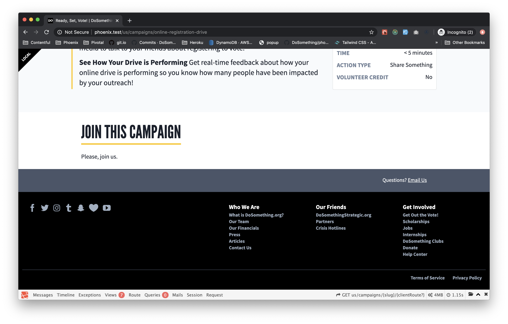

# Landing Page

## Overview

The landing page displayed on a [campaign](development/content-types/campaign.md) when the current user is not signed up.

## Styling

Any heading-1's will be styled as [Section Header titles](https://github.com/DoSomething/phoenix-next/blob/371be4a62e6ebb093ba1f1c42d79c598de258721/resources/assets/components/utilities/SectionHeader/SectionHeader.js#L16-L25) with a larger font size and a yellow underline.

## Content Type Fields

- **Internal Title**: This is for our internal Contentful organization and will be how the entry shows up in search results, etc.

- **Content** : A Rich Text field, which can embed `contentBlock`, `imagesBlock`, and `linkAction` entries.

- **Additional Content** : The legacy campaign template uses this field to display Landing Page content, expecting a `legacyTemplateContent` property.
