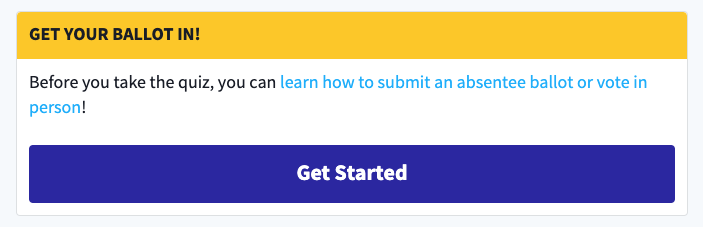

# Link Action

## Overview

Displays a card with a customizable title, Markdown content, and button link. Used to encourage visiting the link.

.

-   Legacy Link Actions (created before 01/22/2021) can render as a plain embedded link or embeddable content (Youtube, Typeform) if the **content** field is empty. These should now be rendered via the [Embed](./embed.md) block.

-   Legacy Link Action can render as a Call To Action card if the `template` field is set to `cta`.

-   Link Actions can be used to control the content on the [Quiz Results](../features/voter-registration.md#Quiz) page for Voter Registration quizzes.

## Content Type Fields

-   **Internal Title**: This is for our internal Contentful organization and will be how the block shows up in search results, etc. (does _not_ display to the user on the page).

-   **Title**: The Link Action title displayed atop the card.

-   **Content** _(optional)_: The Link Action content (Markdown format) displayed within the card above the button.

-   **Link**: A valid Absolute URL or [Tel link](https://www.elegantthemes.com/blog/wordpress/call-link-html-phone-number) usedas the button destination. Supported the `userId` & `northstarId` (assigned to the current user's ID), `campaignId` (assigned to the current Campaign's Campaign ID), `campaignRunId` (assigned to `0`), and `source` (derived from the `utm_source` query parameter defaulting to `web`) tokens (within {} e.g. `https://dosomething.org?userId={userId}`).

-   **Button Text** _(optional)_: The text displayed in the button (defaults to "Visit link").

-   **Additional Content**: _(optional)_: Any custom settings for this page in JSON format:
    -   `sourceDetails`: See [Voter Registration Quiz](../features/voter-registration.md#Quiz)
