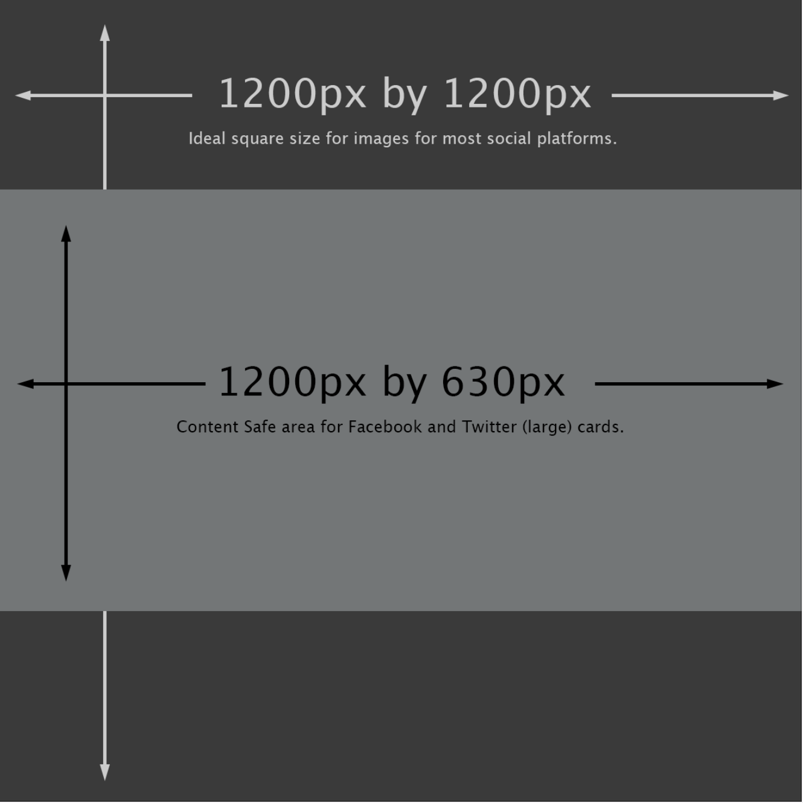

# Metadata

All pages and campaigns on DoSomething.org contain a **Metadata** field that references a [`Metadata` content type](https://app.contentful.com/spaces/81iqaqpfd8fy/content_types/metadata/fields). This content type allows an editor to provide data for the page to help with SEO and sharing the content on social platforms.


By creating a custom **Metadata** content type for a page and filling out the fields, the platform will extract this information and add it as `<meta>` tags to the HTML for the page.

Technically, the platform is setup to automatically attempt to extract default data from the page to populate the `<meta>` tags if no **Metadata** content type is referenced, however by creating and referencing a custom **Metadata** content type for the page, it will override these defaults and customize the visual preview social platforms generate for the page.

The following is an example of the series of `<meta>` tags output for a page:

```html
<meta name="twitter:card" content="summary_large_image" />
<meta name="twitter:title" content="Page Title" />
<meta name="twitter:site" content="@dosomething" />
<meta name="twitter:creator" content="@dosomething" />
<meta name="twitter:image" content="https://example.com/path/to/image.jpg" />

<meta property="og:title" content="Page Title" />
<meta property="og:type" content="article" />
<meta property="og:url" content="https://www.dosomething.org/us/path/to/page" />
<meta property="og:site_name" content="DoSomething.org" />
<meta property="og:image" content="https://example.com/path/to/image.jpg" />
<meta property="og:image:width" content="1200" />
<meta property="og:image:height" content="1200" />
```

It is recommended for editors to add a custom **Metadata** for pages so that they can provide more customized SEO friendly copy and better preview image when a preview link is rendered on other platforms like Facebook and Twitter, etc.

## Contentful Content Type Fields

- **Internal Title**: This is for our internal Contentful organization and will be how the block shows up in search results, etc. It should include the Year-Month and the title of the page to help find this content in the system.
- **Title**: This will be displayed as the headline when embedded and previewed on other sites.
- **Description**: This field will most often be styled as smaller text underneath the title. Mozilla and other experts recommend for this to be about 160 characters.
- **Image**: This image will be displayed alongside the title and description. Implementation differs from site to site, please see the attached image for guidance. The default size should be 1200px x 1200px with centered content.


If there is no metadata image provided, the platform falls back to the Campaign or Page cover photo. If there is no cover photo provided for the Campaign or Page, the platform will fall back to the DS logo in a black square for the preview link image.


## Technical Notes

There is a dedicated **Metadata Entity** that collects the data entered into the fields for the respective Metadata content type entry when retrieving the page date from Contentful and building the object for the page.

The metadata for a page is collected together and organized when a page or campaign controller method returns, calling the `view()` function:

```php
// Example from: app/Http/Controllers/PageController.php

return view('app', [
  // ...
  'metadata' => get_metadata($page),
  // ...
]);

```

Within the `view()` function, a `metadata` variable is created, and assigned an array of data by calling the `get_metada()` helper function and passing it the parent page object that contains all the metadata information.

When the page is rendered, the `master.blade.php` includes a partial view which outputs all the `<meta />` tags within the HTML of the page if the `$metadata` variable is available.

```php
// resources/views/layouts/master.blade.php

// ...
@if(isset($metadata))
    @include('partials.metadata')
@endif
// ...

```

The partial view for the metadata output can be found in `resources/views/partials/metadata.blade.php`.

## Additional Information

The recommended size for a metadata preview image is **1200px x 1200px** with the focus placed in the center. Some platforms like Pinterest, Reddit and Slack will use a full square photo when rendering a preview link image, but Facebook and Twitter will create a landscape cropped version out from the center:



## Resources

You can use the following tools to preview how a page's preview link will show up on a respective platform:

- [Facebook Tool](https://developers.facebook.com/tools/debug/sharing/)
- [Google Tool](https://search.google.com/structured-data/testing-tool/u/0/)
- [Pinterest Tool](https://developers.pinterest.com/tools/url-debugger/)
- [Twitter Tool](https://cards-dev.twitter.com/validator)
