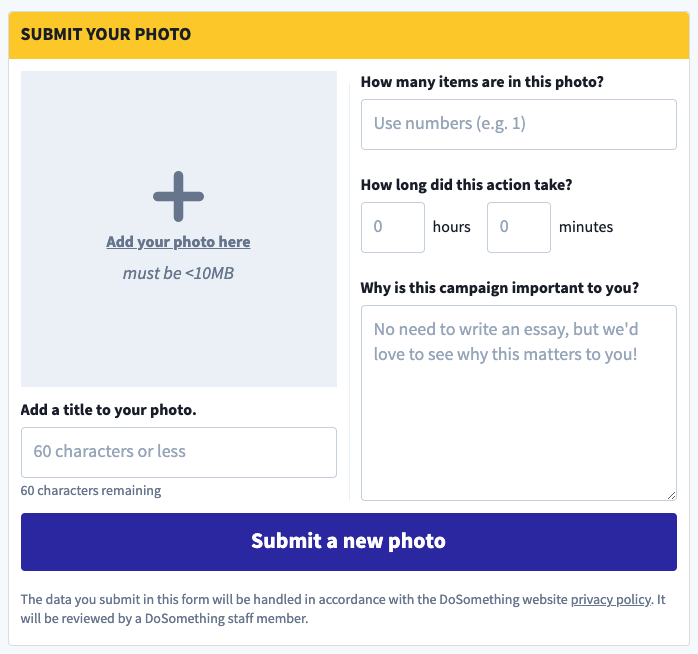
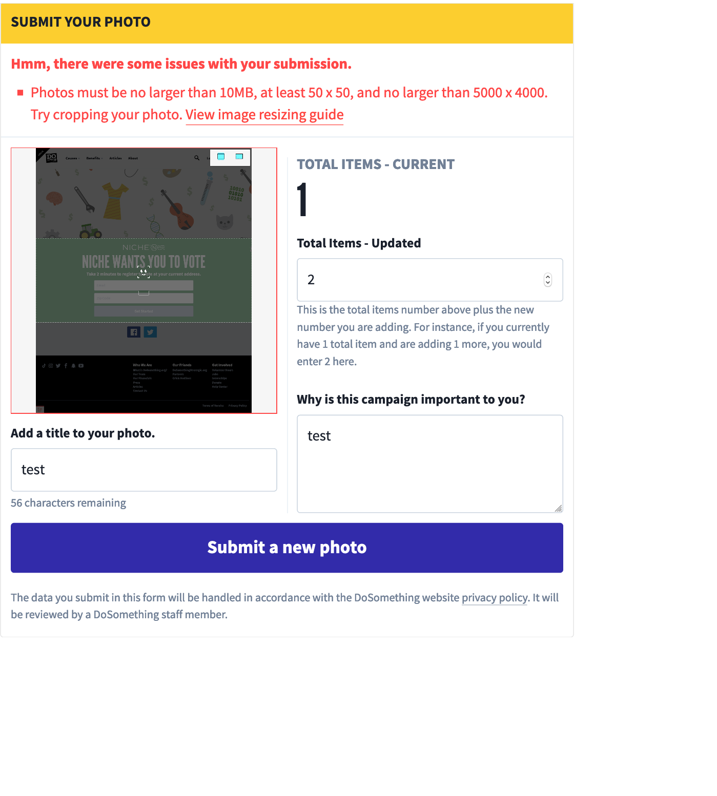

# Photo Submission Action

## Overview

The Photo Submission Action allows users to submit a photo RB post.

<!--  -->

Once the user submits the form successfully, they will be redirected to the Show Submission Page.

## Content Type Fields

-   **Internal Title**: This is for our internal Contentful organization and will be how the block shows up in search results, etc.
-   **Action ID**: The Action ID associated with this action in Northstar.
    <!-- ... -->

## Hours Spent Field

If the associated Northstar Action for this Photo Submission Action (queried using the assign **Action ID** field) qualifies for Volunteer Credit, we display the Hours Spent input fields, allowing the user to submit the time they've spent on this action.

We display separate "hours" and "minutes" input fields which are than converted to a decimal value (e.g. 1 hour & 30 minutes => 1.5) before the Reportback is POSTed to our Activity API.

## Custom File Dimension Validation

The `file` field (which we use to POST the uploaded photo to our Activity API) has strict dimension validations. To ensure clarity for our users, we display a link to our Help Center alongside the validation error message:

