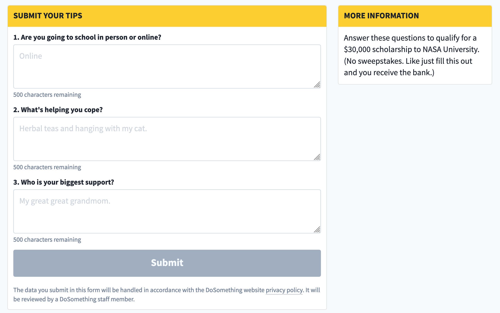

# Questionnaire Action

## Overview

The Questionnaire Action displays a list of questions for the user. Upon submission, the question submissions are stored as individual posts [in Northstar](https://github.com/DoSomething/northstar/blob/50f6b2f9515b12947f15904137df5cf581bf2c47/documentation/endpoints/questionnaires.md), with attribution to the parent Contentful block & associated Action IDs.

The Questionnaire Action supports lazy auth functionality, allowing anonymous users to submit their responses, redirecting them to authenticate before sending the submission to the API.

Once the user submits the form successfully, they will be redirected to the Show Submission Page.

## Content Type Fields

-   **Internal Title**: This is for our internal Contentful organization and will be how the block shows up in search results, etc.
-   **Title**: The title of the Questionnaire. This will appear atop the card.
-   **Questions**: A list of questions for the questionnaire. Each question includes the following fields:

    -   **Title**: The question itself.
    -   **Placeholder**: The placeholder text appearing in the question's text input field.
    -   **Action ID**: A valid Action ID created for this questions specifically. Submissions for this questions will be created as Posts associated with this Action.

-   **Button Text**: Custom text for the form submission button.
-   **Information Title**: The title of the 'more info' card displayed next to the Questionnaire _if_ the **Information Content** field is populated.
-   **Information Content**: The content of the 'more info' card displayed next to the Questionnaire. If left blank, the card will not be displayed.
