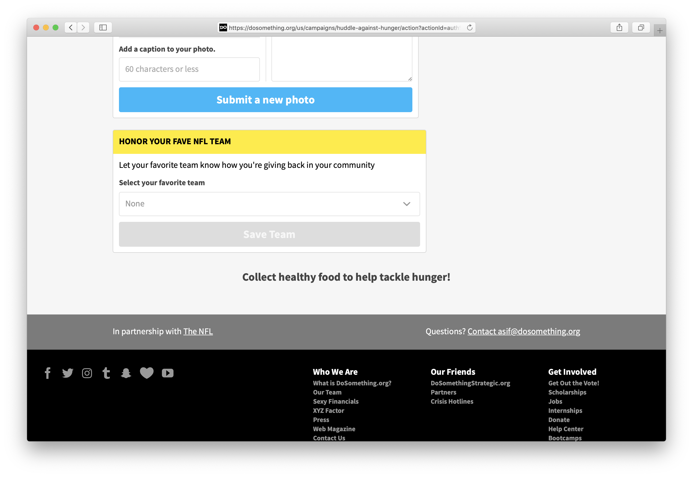
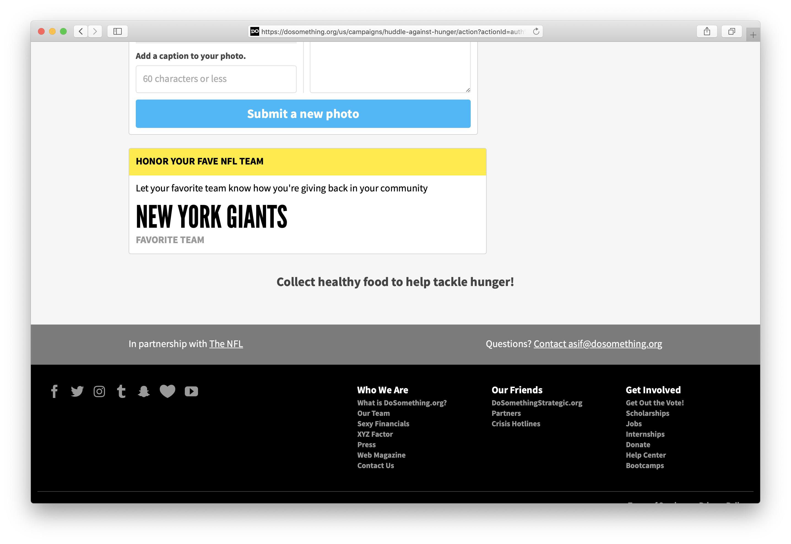

# Metadata

## Overview

The Selection Submission Action allows users to submit a text post via a [`<select>`](https://developer.mozilla.org/en-US/docs/Web/HTML/Element/select) form field displaying a predefined list of options.

Once the user submits the form, the block displays a post-submission state, showcasing the user's submission along with an editor defined label.

## Content Type Fields

- **Internal Title**: This is for our internal Contentful organization and will be how the block shows up in search results, etc.
- **Action ID**: The Action ID associated with this action in Rogue.
- **Title** _(optional)_: The displayed title for the rendered card. (Defaults to "Make a selection").
- **Content**: The content displayed in the card.
- **Selection Field Label** _(optional)_: The label displayed above the selection field. (Defaults to "Select one of the options below").
- **Selection Options**: The full list of selection options, comma separated.
- **Selection Placeholder Option** _(optional)_: The placeholder selection value. This will not be a valid selection. (Defaults to "---").
- **Button Text** _(optional)_: Text to display on the submission button (defaults to "Submit").
- **Post Submission Label**: The text displayed under the user selection, post submission.

## Under The Hood

#### Post Submission

The selection text is submitted using the [`storePost`](https://github.com/DoSomething/phoenix-next/blob/b96abb3a0df3a61ee8caa05f54a9f5b8b8b34dac/resources/assets/actions/post.js#L128-L172) Redux action to post to Rogue.

#### Post Submission State

We wrap the form in an Apollo-GraphQL [<Query>](https://www.apollographql.com/docs/react/essentials/queries#basic) component, querying Rogue for the user's posts filtered by the Action ID. If we find an existing post, we render the post submission state, otherwise, the form as usual. We err on the side of caution when it comes to displaying the form, so if the query returns an error, the user isn't blocked from form submission.

#### Validation

We validate the selection before submitting the form to ensure that it matches one of the defined list of selections. This can help prevent custom and/or nefarious submissions that someone might be inclined to finagle via dom manipulation.
