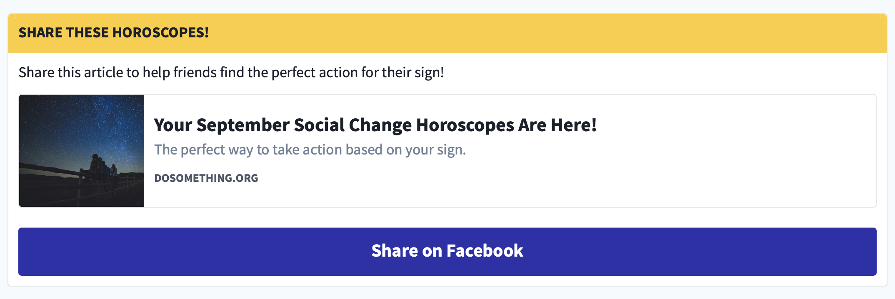

# Share Action

## Overview

Displays a card with text, a link embed, and a button to share the link on social media (Twitter or Facebook).

## Content Type Fields

-   **Internal Title**: This is for our internal Contentful organization and will be how the entry shows up in search results, etc.

-   **Action ID**: The Action ID associated with this action in Rogue.

-   **Title**: The title for the Share Action which displays in the bar atop the card.

-   **Social Platform**: The Social Platform which the share button will launch to share the link on social media. (Facebook or Twitter).

-   **Content**(_optional_): Descriptive content for the Share Action displayed in the card atop the link embed.

-   **Link**: The full URL that the user should share. This URL will be embedded as a link in the card.

-   **Hide Embed**(_optional_): If selected, the link embed will not be displayed in the card.

-   **Affirmation Block**(_optional_): A reference link to the Contentful entry that will be displayed in a modal upon a successful social share.

-   **Affirmation Text**(_optional_): Can be used instead of an Affirmation Block to display a text affirmation for the user in a modal upon successful social share. (Defaults to "Thanks for rallying your friends on Facebook!").

-   **Additional Content**: _(optional)_: Any custom settings for this page in JSON format:
    -   `action`, (e.g. `"action": "social-share"`) is assigned for legacy Share Actions where the Action ID is _not_ assigned, to override the `default` value assigned to the social-share post sent to Rogue if this is a Facebook Share Action and the user is authenticated. (See below).

## Social Share Posts in Rogue

If the **Social Platform** field is assigned to `Facebook`, for authenticated users, when they successfully share their social post, we'll send a request to Rogue on behalf of this user, to create a `social-share` Post.

We use the **Action ID** field to assign this Post to the correct Action in Rogue.

Older Share Actions which pre-date the **Action ID** field will rely on a Campaign ID, which means the Share Action will only update Rogue on _Campaign pages_ (excluding e.g. Story pages, Article pages, or Block pages (`/us/blocks/:id`)). We also assign an `action: "default"` field to the Post to utilize the 'default' Action configured for the campaign, in lieu of an assigned Action ID. (This is sometimes overridden via the `action` field in **Additional Content**).
