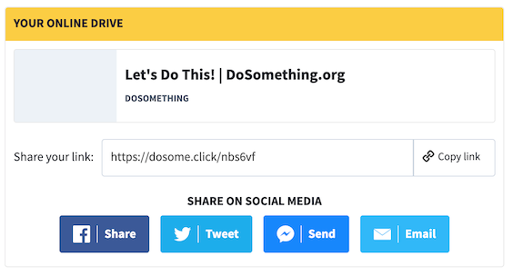

# Social Drive Action

## Overview

Displays a shortened link for the user to share.

## Content Type Fields

- **Internal Title**: This is for our internal Contentful organization and will be how the entry shows up in search results, etc.

- **Link** : The full URL that the user should share. This link will be shortened via API request to [`POST /v2/links`](api-reference/api-v2/links-resource.md) when rendered in the browser.
