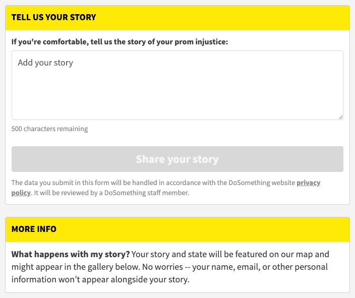

# Text Submission Action

## Overview

The **Text Submission Action** is one of many different types of available reportback actions a DoSomething member can perform on the platform.

## Content Type Fields

- **Internal Title** (`internalTitle`): This is for our internal Contentful organization and will be how the block shows up in search results, etc. It should include the Year-Month and a distinctive title to help find this content in the system.
- **Action ID** (`actionId`): Specifies the Action ID associated with this action in Rogue (Activity Service).
- **Title** (`title`): This will be displayed as the header within the text submission action block.
- **TextFieldLabel** (`textFieldLabel`): Specifies what the copy for the text field label should be.
- **Text Field Placeholder Message** (`textFieldPlaceholder`):
- **Button Text** (`buttonText`):
- **Information Title** (`informationTitle`):
- **Information Content** (`informationContent`):
- **Affirmation Content** (`affirmationContent`):
- **Additional Content** (`additionalContent`):


Most of the fields above related to user-facing fields that show up in the text submission form will provide sensible defaults if no value is provided, but it is best for the editor to customize these to the campaign.


## Technical Notes

<!-- Important information regarding how this content type behaves on the platform and code flow. -->

## Additional Information

<!-- Extra information that could be helpful. -->
