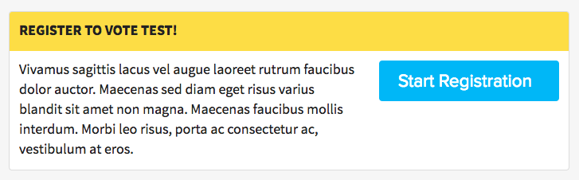

# Voter Registration Action

The Voter Registration Action content type renders a visual component which prompts DoSomething.org members to register to vote by linking to an external voter registration partner.

## Usage Instructions

When creating a new _Voter Registration Action_ on Contentful, an editor is required to enter a `link` field -- which is the full URL where the member should be directed to upon clicking on the button to start their registration.

-   For current entries, this will always be set to a new voting portal hosted directly on our site at `/us/vote`. [Voting Portal](development/features/voter-registration.md#voting-portal)

-   For older entries, this may be set to our [vote.dosomething.org Voting Portal](development/features/voter-registration.md#voting-portal). For even older entries there may be a TurboVote URL, our [previous external voter registration partner before Rock The Vote](https://github.com/DoSomething/chompy/tree/master/docs/imports#rock-the-vote).
