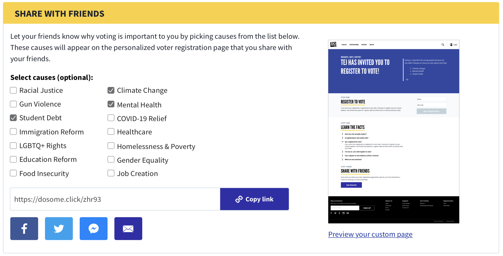

# Voter Registration Drive Action

This block type will display a `SocialDriveAction` that links to the current user's Online Voter Registration Drive (OVRD) Page.

The user is asked to optionally choose causes to urge their friends to vote about, which appends a `voting-reasons` query parameter to the OVRD Page URL. These choices are not persisted: the next time the user visits a `VoterRegistrationDriveAction` block, they will need to reselect their causes.
