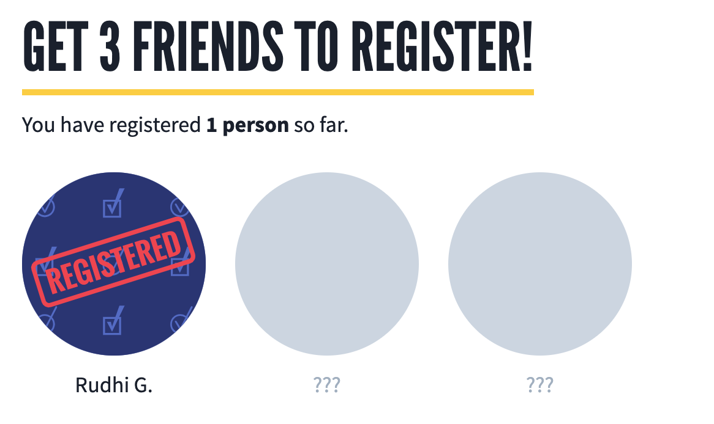

# Voter Registration Referrals Block

This block type displays the current user's completed voter registration referrals in a [`ReferralsGallery`](../features/referrals-gallery.md).

## Fields

- **Internal Title**

- **Title**: Optional `SectionHeader` text, e.g. "Get 3 friends to register!"

## Notes

All block content besides the `title` field is managed in code, e.g. "You have registered **1** friend.".
