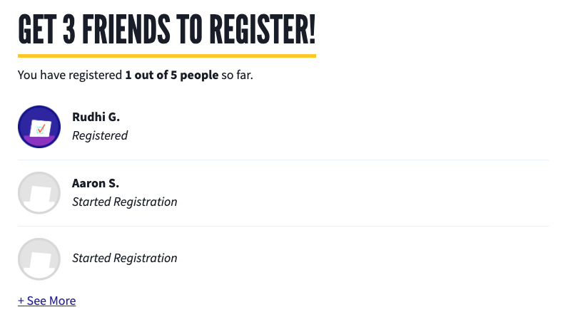

# Voter Registration Referrals Block

This block type displays the current user's latest three completed voter registration referrals (and indicates how many more there are, if there are more than 3).

## Fields

- **Internal Title**

- **Title**: Optional `SectionHeader` text, e.g. "Get 3 friends registered"

## Notes

All block content besides the `title` field is managed in code, e.g. "You have registered _2_ friends".
